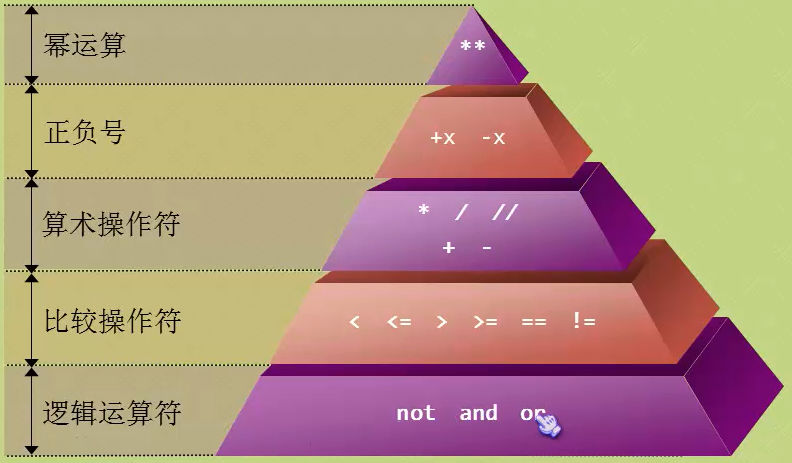

## 目录

- [001 入门简介](#001入门简介)
    - BIF
    - Python 简介
- [002变量与字符串](#002变量与字符串)
    - 变量定义规则
    - 字符串
        1. 原始字符串
        2. 长字符串
- [003条件分支及while循环及and逻辑运算符及引入模块](#003条件分支及while循环及and逻辑运算符及引入模块)
    - 条件分支
    - while循环
    - and 逻辑操作符
    - import 引入模块
    - 猜数字文字游戏
- [004数值类型](#004数值类型)
    * 整型
    * 浮点型
    * 布尔型
    * e记法
        1. 类型转换：
        2. 获取变量类型&&判断变量类型
- [005算数运算符](#005算数运算符)
    - 算数运算符（加减乘除，整数除法，幂运算，取余）
    - 优先级问题（幂运算 > 正负号 > 算术运算符 > 比较运算符 > 逻辑运算符）
    - 比较运算符（大于、小于、等于、大于等于、小于等于、不等于）
    - 逻辑运算符（and与、or或、not非）
- [006分支和循环](#006分支和循环)
    - 飞机大战小游戏逻辑
    - if分支语句
        - 全部if，消耗大
        - if-else 形式
        - if-else 形式（推荐）
    - Python可以有效避免"悬挂else"
    - 条件表达式（三元运算符）
        - `small = x if x < y else y`
    - 断言（assert）
        - 情景：需要确保程序的某个条件一定为真才能让程序正常运行
    - 循环结构
        - while循环
        - for循环
    - 两个重要的控制语句
        - break
        - continue
     
    - **待办p10**
## 001入门简介

### 学习笔记

* **BIF = Built-in functions 内置函数**。Python是脚本程序，脚本程序运行很快，其嵌入了很多内置函数
	* 在shell中查看所有内置函数：
	
			>>> dir(__builtins__)  #查看内置函数（以下小写部分）
			['ArithmeticError', 'AssertionError', 'AttributeError', 'BaseException', 'BlockingIOError', 'BrokenPipeError', 'BufferError', 'BytesWarning', 'ChildProcessError', 'ConnectionAbortedError', 'ConnectionError', 'ConnectionRefusedError', 'ConnectionResetError', 'DeprecationWarning', 'EOFError', 'Ellipsis', 'EnvironmentError', 'Exception', 'False', 'FileExistsError', 'FileNotFoundError', 'FloatingPointError', 'FutureWarning', 'GeneratorExit', 'IOError', 'ImportError', 'ImportWarning', 'IndentationError', 'IndexError', 'InterruptedError', 'IsADirectoryError', 'KeyError', 'KeyboardInterrupt', 'LookupError', 'MemoryError', 'ModuleNotFoundError', 'NameError', 'None', 'NotADirectoryError', 'NotImplemented', 'NotImplementedError', 'OSError', 'OverflowError', 'PendingDeprecationWarning', 'PermissionError', 'ProcessLookupError', 'RecursionError', 'ReferenceError', 'ResourceWarning', 'RuntimeError', 'RuntimeWarning', 'StopAsyncIteration', 'StopIteration', 'SyntaxError', 'SyntaxWarning', 'SystemError', 'SystemExit', 'TabError', 'TimeoutError', 'True', 'TypeError', 'UnboundLocalError', 'UnicodeDecodeError', 'UnicodeEncodeError', 'UnicodeError', 'UnicodeTranslateError', 'UnicodeWarning', 'UserWarning', 'ValueError', 'Warning', 'WindowsError', 'ZeroDivisionError', '__build_class__', '__debug__', '__doc__', '__import__', '__loader__', '__name__', '__package__', '__spec__', 'abs', 'all', 'any', 'ascii', 'bin', 'bool', 'breakpoint', 'bytearray', 'bytes', 'callable', 'chr', 'classmethod', 'compile', 'complex', 'copyright', 'credits', 'delattr', 'dict', 'dir', 'divmod', 'enumerate', 'eval', 'exec', 'exit', 'filter', 'float', 'format', 'frozenset', 'getattr', 'globals', 'hasattr', 'hash', 'help', 'hex', 'id', 'input', 'int', 'isinstance', 'issubclass', 'iter', 'len', 'license', 'list', 'locals', 'map', 'max', 'memoryview', 'min', 'next', 'object', 'oct', 'open', 'ord', 'pow', 'print', 'property', 'quit', 'range', 'repr', 'reversed', 'round', 'set', 'setattr', 'slice', 'sorted', 'staticmethod', 'str', 'sum', 'super', 'tuple', 'type', 'vars', 'zip']
			>>> help(input)
			Help on built-in function input in module builtins:

			input(prompt=None, /)  #查看input用法
    			Read a string from standard input.  The trailing newline is stripped.
    
    			The prompt string, if given, is printed to standard output without a
   			    trailing newline before reading input.
    
    			If the user hits EOF (*nix: Ctrl-D, Windows: Ctrl-Z+Return), raise EOFError.
    			On *nix systems, readline is used if available.

### 练习题

测试题：

0. Python 是什么类型的语言？
	   
      Python是一种计算机程序设计语言。是一种动态的、面向对象的脚本语言。
      > Python是脚本语言                                                                   
      
      > 脚本语言(Scripting language)是电脑编程语言，因此也能让开发者藉以编写出让电脑听命行事的程序。以简单的方式快速完成某些复杂的事情通常是创造脚本语言的重要原则，基于这项原则，使得脚本语言通常比 C语言、C++语言 或 Java 之类的系统编程语言要简单容易。                           
                                                                     
      > * 语法和结构通常比较简单
      > * 学习和使用通常比较简单
      > * 通常以容易修改程序的“解释”作为运行方式，而不需要“编译”
      > * 程序的开发产能优于运行性能
        
      > 一个脚本可以使得本来要用键盘进行的相互式操作自动化。一个Shell脚本主要由原本需要在命令行输入的命令组成，或在一个文本编辑器中，用户可以使用脚本来把一些常用的操作组合成一组串行。主要用来书写这种脚本的语言叫做脚本语言。很多脚本语言实际上已经超过简单的用户命令串行的指令，还可以编写更复杂的程序。
        
        Python的中文释义是：巨蛇，大蟒。
        Python的特点：
        1. 简单
        Python是一种代表简单思想的语言。
        2. 易学
        Python有极其简单的语法。
        3. 免费、开源
        Python是FLOSS（自由/开放源码软件）之一。
        4. 高层语言
        使用Python编写程序时无需考虑如何管理程序使用的内存一类的底层细节。
	    
	    【扩展资料】：
        
        Python的风格：
        
        Python在设计上坚持了清晰划一的风格，这使得Python成为一门易读、易维护，并且被大量用户所欢迎的、用途广泛的语言。
        
        设计者开发时总的指导思想是，对于一个特定的问题，只要有一种最好的方法来解决就好了。
        这在由Tim Peters写的Python格言（称为The Zen of Python）里面表述为：There should be one-- and preferably only one --obvious way to do it. 
        
        这正好和Perl语言（另一种功能类似的高级动态语言）的中心思想TMTOWTDI（There's More Than One Way To Do It）完全相反。
        Python的作者有意的设计限制性很强的语法，使得不好的编程习惯（例如if语句的下一行不向右缩进）都不能通过编译。其中很重要的一项就是Python的缩进规则。

1. IDLE 是什么？
      
      IDLE是一个Python Shell，shell的意思就是“外壳”，基本上来说，就是一个通过键入文本与程序交互的途径！像我们Windows那个cmd窗口，像Linux那个黑乎乎的命令窗口，他们都是shell，利用他们，我们就可以给操作系统下达命令。同样的，我们可以利用IDLE这个shell与Python进行互动。
        
        IDLE是开发python程序的基本IDE（集成开发环境），具备基本的IDE的功能，是非商业Python开发的不错的选择。当安装好python以后，IDLE就自动安装好了，不需要另外去找。
        
2. print() 的作用是什么？
        
        控制台打印
        
3. Python 中表示乘法的符号是什么？
        
        星号 *
        
4. 为什么 >>>print('I love fishc.com ' * 5) 可以正常执行，但 >>>print('I love fishc.com ' + 5) 却报错？
        
        1.因为字符串"*5"表示字符串打印五次;
        
        2.执行>>>print('I love fishc.com ' + 5)错误信息如下：
        TypeError: can only concatenate str (not "int") to str
        即用于连接字符串时，加号两侧必须都是字符串类型的；
        【个人理解】：“+”号表示字符串连接或者加法，当它连接字符串类型和整型时，会出现类型转换错误，即他们两种类型不能直接相加。
        
5. 如果我需要在一个字符串中嵌入一个双引号，正确的做法是？
        
        加上转译符“\”
        如下
        >>> print("\"")  #将打印出  "
        "
        
6. 为什么我们要使用 Python3？Python2到底有什么问题？看起来很多程序员依然都在使用Python2？
        
        确实还有相当多的程序员在使用 Python2，不过 Python3 才是 Python 发展的未来，就像 XP 和 WIN7 一样。你也不用担心，如果你了解了 Python3，Python2 的代码阅读对于你来说根本不成问题！

动动手：

0. 动手试试直接输入>>>5+8 与输入>>>print(5+8) 有何不同？
        
        虽然结果相同;
        不妨试试直接直接输入 >>>'I love fishc.com!' 与输入 >>>print('I love fishc.com!') 有何不同？
        没错，直接输入是将结果及类型打印到屏幕上，而print是将结果打印到屏幕上，自己试试并观察结果！
        >>> 'I love python'
        'I love python'
        >>> print('I love Python')
        I love Python
        >>> print("I love Python")
        I love Python
        
1. 在交互模式中，使用 Python 计算一年有多少秒？

        print("-------------计算一年有多少秒-------------")
        
        temp = 365*24*60*60
        
        print(str(temp) + "s")
        
        结果运行如下：
        -------------计算一年有多少秒-------------
        31536000s
        
2. 设置你的操作系统的环境变量，以便可以轻松进入 Python 环境：
        
        G:\Program Files\Python\;
        添加到系统环境变量Path中

## 002变量与字符串

### 学习笔记

1. 变量
    * 变量声明，不需要声明其类型
    * 在使用变量前，要先对其赋值
    * 变量名可以包含字母、数字、下划线，但是变量名不可以数字开头
    * 字母可以是大写或者小写，但大写的与小写的两个变量是不同的。
2. 字符串：
    * 创建一个字符串时，要在字符两边加上引号。单引号或者双引号都可以。
    * 需要打印引号双引号，一种方式是加转译符“\’”；另一种方式是？？？见习题
    1. 原始字符串
            
            >>> str = 'C:\now'
            >>> str
            'C:\now'
            >>> print(str)  # 会被误认为是换行符
            C:
            ow
            
            >>> str = 'C:\\now'  #使用反斜杠对反斜杠自身转译
            >>> str
            'C:\\now'
            >>> print(str)
            C:\now
            
            >>> str = r'G:\Program Files\Python'  #加上r表示原始字符串
            >>> str
            'G:\\Program Files\\Python'
            >>> print(str)
            G:\Program Files\Python

            但是，如果原始字符串最后有个反斜杠会报错，详见练习题
            >>> str = r'G:\Program Files\Python\'
            SyntaxError: EOL while scanning string literal
            
            # 最后加空格？？？
            >>> str = r'G:\Program Files\Python\ '
            >>> str
            'G:\\Program Files\\Python\\ '
            >>> print(str)
            G:\Program Files\Python\ 
            >>> 
    
    2. 长字符串
        
            一个跨越多行的字符串，如
            
                语法和结构通常比较简单
                学习和使用通常比较简单
                通常以容易修改程序的“解释”作为运行方式，而不需要“编译”
                程序的开发产能优于运行性能
            
            这时，需要使用到三重引号字符串。三引号的作用：利用三引号可以实现输出多行文本。
            
                >>> str = """语法和结构通常比较简单
                学习和使用通常比较简单
                通常以容易修改程序的“解释”作为运行方式，而不需要“编译”
                程序的开发产能优于运行性能"""
                >>> str
                '语法和结构通常比较简单\n学习和使用通常比较简单\n通常以容易修改程序的“解释”作为运行方式，而不需要“编译”\n程序的开发产能优于运行性能'
                >>> print(str)
                语法和结构通常比较简单
                学习和使用通常比较简单
                通常以容易修改程序的“解释”作为运行方式，而不需要“编译”
                程序的开发产能优于运行性能
            
## 003条件分支及while循环及and逻辑运算符及引入模块

## 学习笔记

* 条件分支：
        
        if 条件 :
            # 条件为真时，执行的操作（前面加一个tab符缩进）
        else :
            # 条件为假时，执行的操作（前面加一个tab符缩进）

* while循环：
        
        while 条件 :
            # 循环体：条件为真时，执行的操作（前面加一个tab符缩进）
            
* and 逻辑操作符，优先级小于 大于、小于 
* 引入模块：`import 模块`

        import random
        secret = random.randint(1,10)
        print(secret)
        print("----------文字游戏升级--------------")
        flag = 0
        temp = input('请猜测一个1-10间的数字:')
        guess = int(temp)
        flag = flag + 1
        
        if guess == secret :
            print('猜对了！')
        else:
            if guess > secret :
                print('哥，大了大了！')
            else : 
                print('哥，小了！')
            while flag < 3:
                temp = input('猜错了，请猜重新测一个数字:')
                guess = int(temp)
                if guess == secret :
                    print('猜对了！')
                else:
                    if guess > secret :
                        print('哥，大了大了！')
                    else : 
                        print('哥，小了！')
                flag = flag + 1    
        print('游戏结束')
        
        -----------------------------
                    更新：
        -----------------------------
        
        import random
        secret = random.randint(1,10)
        # print(secret)
        print("----------文字游戏升级--------------")
        flag = 0
        while flag < 3 :
            temp = input('请猜测一个1-10间的数字:')
            guess = int(temp)
            if guess == secret :
                print('猜对了！')
                break # 如果猜对了，跳出循环
            else:
                if guess > secret :
                    print('哥，大了大了！')
                else :
                    print('哥，小了！')
            flag = flag + 1
        print('游戏结束')
        
        -----------------------------
                    更新：
        -----------------------------
        
        import random
        secret = random.randint(1,10)
        # print(secret)
        print("----------文字游戏升级--------------")
        flag = 0
        while flag < 3 :
            temp = input('请猜测一个1-10间的数字:')
            guess = int(temp)
            if guess == secret :
                print('猜对了！')
                break # 如果猜对了，跳出循环
            else:
                if guess > secret :
                    print('哥，大了大了！')
                else :
                    print('哥，小了！')
            flag = flag + 1
        print('游戏结束')

## 004数值类型

### 学习笔记

* 整型
* 浮点型
* 布尔型
* e记法

        >>> 150000
        150000
        >>> 1.5E5
        150000.0
        >>> 1.5e5
        150000.0
        >>> 0.000015
        1.5e-05
        >>> 1.5E-5
        1.5e-05

1. 类型转换：
    * 转换成整数： int()
    * 转换成字符串： str()
    * 转换成浮点数： float()
            
            >>> a = '520'
            >>> b = float(a)  # 数值字符串转浮点型
            >>> b
            520.0
            >>> a = 520
            >>> b = float(a)  # 整型转浮点型
            >>> b
            520.0
            >>> a = 5.99
            >>> b = int(a)   # 浮点型强制转换成int型，去尾法
            >>> b
            5
            >>> b = int("学习Pyhon")    # 非数值型字符串无法转成整型
            Traceback (most recent call last):
              File "<pyshell#17>", line 1, in <module>
                b = int("学习Pyhon")
            ValueError: invalid literal for int() with base 10: '学习Pyhon'
            >>> a = 5.99    
            >>> b = str(a)      # 浮点型转成字符串
            >>> b
            '5.99'
            >>> c = str(5e19)
            >>> c
            '5e+19'
            >>> c = str(0.000015)
            >>> c
            '1.5e-05'        
            >>> a = '5.99'      # 浮点型字符串转成浮点型
            >>> b = float(a)
            >>> b
            5.99
            >>> a = '5'         # 整型字符串转成浮点型
            >>> b = float(a)
            >>> b
            5.0
            b = float("学习Pyhon")        # 非数值型字符串无法转成浮点型
            Traceback (most recent call last):
              File "<pyshell#33>", line 1, in <module>
                b = float("学习Pyhon")
            ValueError: could not convert string to float: '学习Pyhon'
            
            >>> int('11.22')    # 浮点型字符串不可以强制转换成int型
            Traceback (most recent call last):
              File "<pyshell#96>", line 1, in <module>
                int('11.22')
            ValueError: invalid literal for int() with base 10: '11.22'

2. 获取变量类型&&判断变量类型
    * type()
            
            >>> a = 520
            >>> type(a)
            <class 'int'>
            
            >>> type(5.2)
            <class 'float'>
            
            >>> type(True)
            <class 'bool'>
            >>> type(flase)
            
            >>> type(False)
            <class 'bool'>
            
            >>> type(5e15)
            <class 'float'>
            
            >>> type('520')
            <class 'str'>
    
    * isinstance()
            
            >>> a = "学习Python"
            >>> isinstance(a,str)
            True
            >>> isinstance(a,int)
            False
            
## 005算数运算符

### 学习笔记

1. 算术运算符
    * `+` 
    * `*` 
    * `/` 
    * `%` 取余数
    * `**` 幂运算  `3**2  # 结果就是3的2次幂，即9`
    * `//` 表示整数除法,返回一个不大于" / "计算结果的最大整数int，特别注意如果其中一个操作数位负数，则结果必为负数。

            >>> a = 5/3
            >>> b = 5//3
            >>> c = -5/3
            >>> d = -5//3   # 整数除法本来结果 -1.67 不大于它的最大整数为-2（数轴向左移动，最近的整数）
        
            >>> print(a,b,c,d,sep=",")      # 按照规定的分隔符逗号隔开
            1.6666666666666667,1,-1.6666666666666667,-2
        
            >>> print(a,b,c,d,sep="\n")     # 按照换行符隔开，结果自动换行
            1.6666666666666667
            1
            -1.6666666666666667
            -2
        
            >>> print(a,b,c,d)    # 默认按照1个空格隔开
            1.6666666666666667 1 -1.6666666666666667 -2
            关于输出print的说明：
            >>> help(print)
            Help on built-in function print in module builtins:
        
            print(...)
                print(value, ..., sep=' ', end='\n', file=sys.stdout, flush=False)
            
                Prints the values to a stream, or to sys.stdout by default.
                Optional keyword arguments:
                file:  a file-like object (stream); defaults to the current sys.stdout.
                sep:   string inserted between values, default a space.
                end:   string appended after the last value, default a newline.
                flush: whether to forcibly flush the stream.

2. 优先级问题
    * 
    * 处于优先级同一行的遵从从左到右依次计算，金字塔上面的优先级高于下面的 
    *
    * 先乘除后加减
    * 比较运算符 高于 逻辑运算符
    * 幂运算符`**`比其左侧一元运算符优先级高，比其右侧一元运算符优先级低
           
            >>> -3 ** 2
            -9
            >>> -(3**2)
            -9
            >>> 3 ** - 2
            0.1111111111111111
            >>> 3 ** (-2)
            0.1111111111111111

3. 比较运算符：根据表达式的值的真假来返回bool 类型的值
    * `<`       
    * `<=`       
    * `>`       
    * `>=`       
    * `==`       
    * `!=`     
4. 逻辑运算符
    * `and`  # 与，都真则真   
    * `or`   # 或者，都假才假   
    * `not`  # 取相反类型的bool值  
            
            # 非零整数值都解释成True
            
            >>> not True
            False
            >>> not False
            True
            >>> not 0
            True
            >>> not 4
            False
            >>> 3 < 4 < 5    # 被解释成 3 < 4and  4 < 5 即：(3 < 4) and (4 < 5)
            True
            >>> 3 < 4and  4 < 5
            True
            >>> 3 < 4 and  4 < 5
            True
            >>> (3 < 4) and (4 < 5)
            True  
            
## 006分支和循环       

### 学习笔记

* 引入： 飞机大战小游戏逻辑
        
        加载背景音乐
        播放背景音乐（设置单曲循环）
        我方飞机诞生
        
        interval = 0
        
        while True:
            if 用户是否点击关闭按钮:
                退出程序
            
            interval += 1
            if interval ==50:
                interval = 0
                小飞机诞生
            
            小飞机移动一个位置
            屏幕刷新
            
            if 用户鼠标产生移动:
                我放飞机中心位置 = 用户鼠标位置
                屏幕刷新
            
            if 我方飞机与小飞机发生肢体冲突:
                我方挂，播放撞机音乐
                修改我方飞机图案
                打印“Game over”
                停止背景音乐，最好淡出

1. if分支语句：
    * 例子：按照100分制，90分以上成绩为A，80-90为B，60-80为C，60以下为D，设计程序，当输入分数，自动转换成等级打印。
    1. 全部if，消耗大
            
            score = int(input('请输入一个整数分数：'))
            if 100 >= score >= 90:
                print('A')
            if 90 > score >= 80:   # 即使上面的语句通过，也会执行
                print('B')
            if 80 > score >= 60:   # 即使上面的语句通过，也会执行
                print('C')
            if 60 > score >= 0:    # 即使上面的语句通过，也会执行
                print('D')
            if score < 0 or score > 100:    # 即使上面的语句通过，也会执行
                print('输入错误！')
    
    2. if-else 形式：由于缩进严格原则，所以易读性差，不美观。但是性能比1.好
            
            score = int(input('请输入一个整数分数：'))
            if 100 >= score >= 90:
                print('A')
            else:
                if 90 > score >= 80:
                    print('B')
                else:
                    if 80 > score >= 60:
                        print('C')
                    else:
                        if 60 > score >= 0:
                            print('D')
                        else:
                             print('输入错误！')
    
    3. 使用if-elif-else，对第二种方式的改进形式，美观易读。（其中最后一个else:如不需要，可以省略）
            
            score = int(input('请输入一个整数分数：'))
            if 100 >= score >= 90:
                print('A')
            elif 90 > score >= 80:
                print('B')
            elif 80 > score >= 60:
                print('C')
            elif 60 > score >= 0:
                print('D')
            else:
                print('输入错误！')        
            
2. **Python可以有效避免"悬挂else"**，因为其强制缩进原则，同一个缩进级别的else匹配其相同缩进级别的if语句    
        
        if ( hi > 2 )    # 与下面的else配套
            if ( hi > 7 )   # 若要与下面else配套，需要将下面else缩进
                print("好棒！")
        else:   # 这里的else会匹配同一缩进级别的if
            print("切~")            

3. 条件表达式（三元运算符）
        
        x,y = 4,5
        if x < y:
            small = x
        else:
            small = y
        
        -------改为三元运算符：---------
        
        x,y = 4,5
        small = x if x < y else y

4. 断言（assert）
    * 当assert 关键字后面的条件为假的时候，程序崩溃，并抛出AssertionError异常         
           
           >>> assert 3 > 4
           Traceback (most recent call last):
             File "<pyshell#95>", line 1, in <module>
               assert 3 > 4
           AssertionError
    
    * 一般来说，我们可以用assert在程序中置入检查点，当需要确保程序的某个条件一定为真才能让程序正常运行的话，assert关键字就非常有用了。           

5. 循环结构
    * while循环：
            
            while 条件 :
                # 循环体：条件为真时，执行的操作（前面加一个tab符缩进）
    
    * for循环
            
            for 目标 in 表达式
                # 循环体
        * 示例：
        
                # 1. 遍历字符串
                >>> favourite = 'Python'
                >>> for i in favourite:
                	print(i,end = ' ')
                
                	
                P y t h o n 
                
                # 2. 遍历数组
                >>> member = ['Python','Java','php','C#','C']
                >>> for each in member:
                	print(each,len(each))
                
                	
                Python 6
                Java 4
                php 3
                C# 2
                C 1     

6. range()内置函数
        
        # 常常与for循环配合使用：
        
        help(range)
        Help on class range in module builtins:
        
        class range(object)
         |  range(stop) -> range object
         |  range(start, stop[, step]) -> range object
         |  
         |  Return an object that produces a sequence of integers from start (inclusive)
         |  to stop (exclusive) by step.  range(i, j) produces i, i+1, i+2, ..., j-1.
         |  start defaults to 0, and stop is omitted!  range(4) produces 0, 1, 2, 3.
         |  These are exactly the valid indices for a list of 4 elements.
         |  When step is given, it specifies the increment (or decrement).

    * 语法：range(start,stop[,step])-> range object
        * 三个参数 ：
        * start:默认为0，可以指定起始数值，start包含在结果内
        * stop:不包括在结果内
        * step:步长，可选参数
        * 创建一个从start开始到stop结束的整数序列（range对象类型），stop不包含在内。
                
                >>> range(5)
                range(0, 5)
                
                >>> list(range(5))
                [0, 1, 2, 3, 4]
           
                >>> for i in range(5):     # 未指定start则默认从0开始
                	print(i)
                                
                	
                0
                1
                2
                3
                4
                
                >>> for i in range(2,9):    # 未指定步长，则从2开始按照步长1增加到 < 9 的所有数 
                	print(i)
                
                	
                2
                3
                4
                5
                6
                7
                8
                
                >>> for i in range(1,10,2):     # 设置了步长为2，从1按照步长一直到10，其中10不包括在内
                	print(i)
                
                	
                1
                3
                5
                7
                9
                
                >>> len(range(2,9))
                7

7. 两个重要的控制语句
    * `break`：结束循环，终止当前循环，即跳出循环体
            
            bingo = 'Python'
            answer = input('目前在学哪门语言：')
            
            while True:
                if answer == bingo:
                    break       # 上面条件满足的话，直接跳出当前循环体
                answer = input('抱歉，错了，请重新输入（答案正确才能退出游戏）：')
            
            print('哟哟，不错哦！')
            print('游戏结束')

    * `continue`：终止本轮循环，并开启下一轮循环。注意在开启下一轮循环前会先判断循环条件是否为True，为True开启下一轮循环，否则退出当前循环体
        
            for i in range(10):
                if i % 2 != 0:   # 判断被2整除余数不是0，即不是偶数时
                    print(i)
                    continue    # 结束当前循环，判断循环条件是否满足，满足的话开启下一轮循环
                i += 2
                print(i)
                      