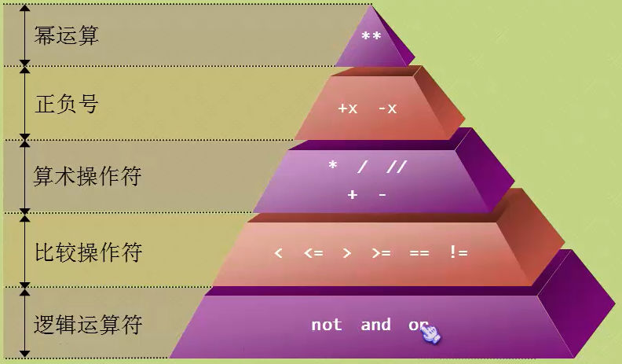
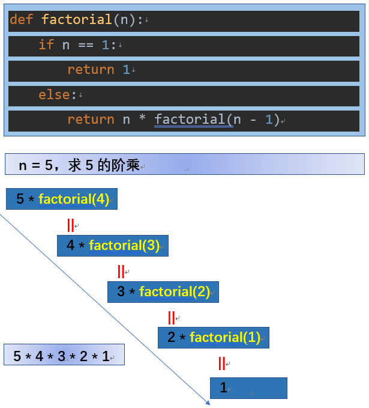
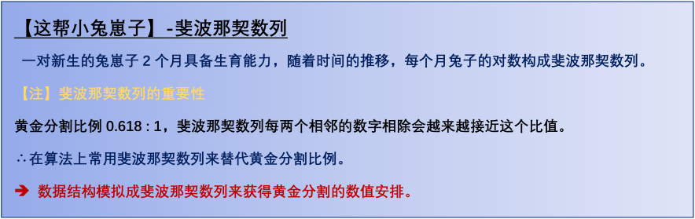
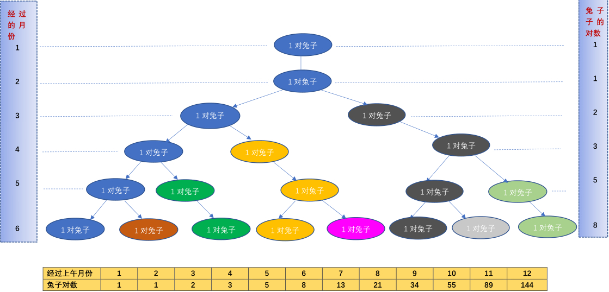
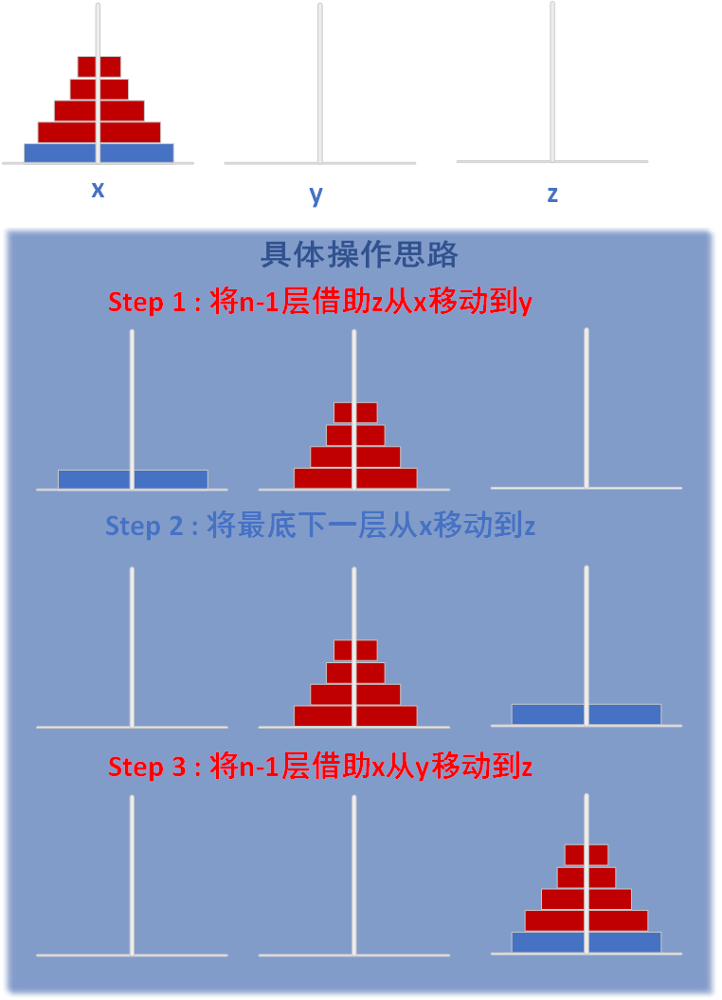

## 目录

- [001 入门简介](#001入门简介)
    - BIF
    - Python 简介
- [002变量与字符串](#002变量与字符串)
    - 变量定义规则
    - 字符串
        1. 原始字符串
        2. 长字符串
- [003条件分支及while循环及and逻辑运算符及引入模块](#003条件分支及while循环及and逻辑运算符及引入模块)
    - 条件分支
    - while循环
    - and 逻辑操作符
    - import 引入模块
    - 猜数字文字游戏
- [004数值类型](#004数值类型)
    * 整型
    * 浮点型
    * 布尔型
    * e记法
        1. 类型转换：
        2. 获取变量类型&&判断变量类型
- [005算数运算符](#005算数运算符)
    - 算数运算符（加减乘除，整数除法，幂运算，取余）
    - 优先级问题（幂运算 > 正负号 > 算术运算符 > 比较运算符 > 逻辑运算符）
    - 比较运算符（大于、小于、等于、大于等于、小于等于、不等于）
    - 逻辑运算符（and与、or或、not非）
- [006分支和循环](#006分支和循环)
    - 飞机大战小游戏逻辑
    - if分支语句
        - 全部if，消耗大
        - if-else 形式
        - if-else 形式（推荐）
    - Python可以有效避免"悬挂else"
    - 条件表达式（三元运算符）
        - `small = x if x < y else y`
    - 断言（assert）
        - 情景：需要确保程序的某个条件一定为真才能让程序正常运行
    - 循环结构
        - while循环
        - for循环
    - 两个重要的控制语句
        - break
        - continue
    
- [007列表：打了激素的数组](#007列表打了激素的数组)   
    * 创建列表
    * 向列表中添加元素
    * 从列表中获取元素
    * 从列表删除元素 
    * 列表分片（slice）
    * 列表的一些常用操作符
    * 列表类型(list)的BIF（内置函数）  
- [008元组：戴上了枷锁的列表](#008元组戴上了枷锁的列表) 
    - 创建和访问一个元组
    - 更新和删除一个元组     
    - 元组相关的操作符
    - 成员操作符
    - 关系操作符
    - 逻辑操作符
- **[009序列](#009序列)**   
    1. **列表、元组和字符串的共同点**
    2. `list()`把一个可迭代对象转化为列表
    3. `tuple()`把一个可迭代对象转化为元组 
    4. `str()`把obj对象转换为字符串   
    5. `len()` —— 返回序列的长度（元素个数） 
    6. `max()`、`min()` —— 返回序列或者参数中最大值、最小值   
    7. `sum(iterable[,start=0])` —— 返回序列iterable和可选参数start的总和
    8. `sorted()` —— 序列排序，返回值为list类型 
    9. `reversed()` —— 倒置，返回一个迭代器对象
    10. `enumerate(iterable, start=0)` —— 返回enumerate object
    11. `zip()` —— 从0脚标开始，将两个序列成对打包成元组
- **[010函数:Python的乐高积木](#010函数)**
    1. 函数的定义与调用
    2. 形参与实参
    3. 关键字参数
    4. 默认参数（定义可默认值的参数）
    5. 收集参数 
    6. 函数与过程
    7. 局部变量和全局变量
    	1. 在函数内可以访问全局变量，但不要试图去修改它。关于全局变量的使用一定要谨慎！    
        2. 在函数内试图修改全局变量的话，Python会在函数内创建一个同名局部变量(**起到了对修改全局变量的屏蔽作用，这时试图给全局变量赋值（修改），实际上是给同名局部变量赋值而已！**)，他们两个变量没在一个区中。  
        3. 作用域。
    	4. 如果函数内需要修改全局变量的值，需要用到`global` 关键字 
    8. 内嵌函数
    9. **闭包**
        * 内嵌函数中，闭包原则本不可以修改外部作用域，Python3新加 `nonlocal` 关键字
    10. **lambda表达式**
    	1. Python允许使用`lambda`关键字来创建**匿名函数**.
    	2. lambda表达式的作用
    11. 介绍两个BIF-filter/map（应用lambda）
    	1. **`filter()`** —— filter(function or None, iterable) --> filter object
    	2. **`map`** —— map(func, *iterables) --> map object
- **[011递归](#011递归)**    
    1. 递归易产生深度溢出
    2. 获取 & 设置递归深度  
    	1. 获取递归深度 
    	2. 设置递归深度 
    3. 实例：递归求阶乘
    	1. 常规解法（迭代）
    	2. 递归解法 
    4. 递归的要求
        * 调用函数自身
        * 设置了自身正确的返回值，以及达到条件不再调用自身
    5. 递归的实质
    6. 阶乘实际上没必要使用递归来计算。
    	* 当计算一个比较大的数值的阶乘的时候，会出现超出递归深度而产生错误。
    7. 要把递归用在恰到好处的地方才能发挥最大功效！
        * 发明树的定义
        * 解汉诺塔 
    8. 递归来计算斐波那契数列数值：这帮小兔崽子！
    	1. 斐波那契数列的重要性，引入
    	2. 图表斐波那契数列
    	3. 数学函数定义斐波那契数列
    	4. 问题：假设我们需要求出经历了20个月后，总共有多少对小兔崽子？（迭代(常规 Vs list) VS 递归）
    		1. 迭代：使用迭代效率较递归做法高，较优
    		2. 递归：# 分治思 # 递归来做效率很低
    		3. list容器迭代：# 空间复杂度较高	
    9. 使用递归解汉诺塔问题
- [012字典：当索引不好用时](#012字典)
    1. **字典类型 对比 序列类型** 		
    	1. Python当中唯一的映射类型,key-value形式；      
        2. 区分序列类型：序列是以数组的形式进行存储，通过索引来取相应位置的值，数组中第一个元素的索引值为0，以此类推。一般索引值与对应的数据毫无关系。	
    2. 字典类型的BIF		
    	1. `fromkeys()` —— 返回一个新的字典
    	2. `keys()`、`values()`、`items()` —— 配合迭代访问
    	3. 直接使用key访问字典，key不存在的话会报错；但是通过`get()`访问比较宽松  
    	4. 成员关系操作符：in、not in —— 判断key是否在字典当中 
    	5. `clear()` —— 清空字典 与 赋值空字典是有区别的
    	6. copy() —— 对字典的浅（shadow）拷贝（copy），与字典赋值是有区别的
    	7. pop()与popitem()  
    	8. `setdefault()` 
    	9. **update()** —— 更新，若键存在，即更新，否则插入。参数为dict或者元组形式的list. 

- [ ] **待办p15**：字符串BIF、源码方法学习帮助文档

---

## 001入门简介

### 学习笔记

* **BIF = Built-in functions 内置函数**。Python是脚本程序，脚本程序运行很快，其嵌入了很多内置函数
	* 在shell中查看所有内置函数：
	
			>>> dir(__builtins__)  #查看内置函数（以下小写部分）
			['ArithmeticError', 'AssertionError', 'AttributeError', 'BaseException', 'BlockingIOError', 'BrokenPipeError', 'BufferError', 'BytesWarning', 'ChildProcessError', 'ConnectionAbortedError', 'ConnectionError', 'ConnectionRefusedError', 'ConnectionResetError', 'DeprecationWarning', 'EOFError', 'Ellipsis', 'EnvironmentError', 'Exception', 'False', 'FileExistsError', 'FileNotFoundError', 'FloatingPointError', 'FutureWarning', 'GeneratorExit', 'IOError', 'ImportError', 'ImportWarning', 'IndentationError', 'IndexError', 'InterruptedError', 'IsADirectoryError', 'KeyError', 'KeyboardInterrupt', 'LookupError', 'MemoryError', 'ModuleNotFoundError', 'NameError', 'None', 'NotADirectoryError', 'NotImplemented', 'NotImplementedError', 'OSError', 'OverflowError', 'PendingDeprecationWarning', 'PermissionError', 'ProcessLookupError', 'RecursionError', 'ReferenceError', 'ResourceWarning', 'RuntimeError', 'RuntimeWarning', 'StopAsyncIteration', 'StopIteration', 'SyntaxError', 'SyntaxWarning', 'SystemError', 'SystemExit', 'TabError', 'TimeoutError', 'True', 'TypeError', 'UnboundLocalError', 'UnicodeDecodeError', 'UnicodeEncodeError', 'UnicodeError', 'UnicodeTranslateError', 'UnicodeWarning', 'UserWarning', 'ValueError', 'Warning', 'WindowsError', 'ZeroDivisionError', '__build_class__', '__debug__', '__doc__', '__import__', '__loader__', '__name__', '__package__', '__spec__', 'abs', 'all', 'any', 'ascii', 'bin', 'bool', 'breakpoint', 'bytearray', 'bytes', 'callable', 'chr', 'classmethod', 'compile', 'complex', 'copyright', 'credits', 'delattr', 'dict', 'dir', 'divmod', 'enumerate', 'eval', 'exec', 'exit', 'filter', 'float', 'format', 'frozenset', 'getattr', 'globals', 'hasattr', 'hash', 'help', 'hex', 'id', 'input', 'int', 'isinstance', 'issubclass', 'iter', 'len', 'license', 'list', 'locals', 'map', 'max', 'memoryview', 'min', 'next', 'object', 'oct', 'open', 'ord', 'pow', 'print', 'property', 'quit', 'range', 'repr', 'reversed', 'round', 'set', 'setattr', 'slice', 'sorted', 'staticmethod', 'str', 'sum', 'super', 'tuple', 'type', 'vars', 'zip']
			>>> help(input)
			Help on built-in function input in module builtins:

			input(prompt=None, /)  #查看input用法
    			Read a string from standard input.  The trailing newline is stripped.
    
    			The prompt string, if given, is printed to standard output without a
   			    trailing newline before reading input.
    
    			If the user hits EOF (*nix: Ctrl-D, Windows: Ctrl-Z+Return), raise EOFError.
    			On *nix systems, readline is used if available.

### 练习题

测试题：

0. Python 是什么类型的语言？
	   
      Python是一种计算机程序设计语言。是一种动态的、面向对象的脚本语言。
      > Python是脚本语言                                                                   
      
      > 脚本语言(Scripting language)是电脑编程语言，因此也能让开发者藉以编写出让电脑听命行事的程序。以简单的方式快速完成某些复杂的事情通常是创造脚本语言的重要原则，基于这项原则，使得脚本语言通常比 C语言、C++语言 或 Java 之类的系统编程语言要简单容易。                           
                                                                     
      > * 语法和结构通常比较简单
      > * 学习和使用通常比较简单
      > * 通常以容易修改程序的“解释”作为运行方式，而不需要“编译”
      > * 程序的开发产能优于运行性能
        
      > 一个脚本可以使得本来要用键盘进行的相互式操作自动化。一个Shell脚本主要由原本需要在命令行输入的命令组成，或在一个文本编辑器中，用户可以使用脚本来把一些常用的操作组合成一组串行。主要用来书写这种脚本的语言叫做脚本语言。很多脚本语言实际上已经超过简单的用户命令串行的指令，还可以编写更复杂的程序。
        
        Python的中文释义是：巨蛇，大蟒。
        Python的特点：
        1. 简单
        Python是一种代表简单思想的语言。
        2. 易学
        Python有极其简单的语法。
        3. 免费、开源
        Python是FLOSS（自由/开放源码软件）之一。
        4. 高层语言
        使用Python编写程序时无需考虑如何管理程序使用的内存一类的底层细节。
	    
	    【扩展资料】：
        
        Python的风格：
        
        Python在设计上坚持了清晰划一的风格，这使得Python成为一门易读、易维护，并且被大量用户所欢迎的、用途广泛的语言。
        
        设计者开发时总的指导思想是，对于一个特定的问题，只要有一种最好的方法来解决就好了。
        这在由Tim Peters写的Python格言（称为The Zen of Python）里面表述为：There should be one-- and preferably only one --obvious way to do it. 
        
        这正好和Perl语言（另一种功能类似的高级动态语言）的中心思想TMTOWTDI（There's More Than One Way To Do It）完全相反。
        Python的作者有意的设计限制性很强的语法，使得不好的编程习惯（例如if语句的下一行不向右缩进）都不能通过编译。其中很重要的一项就是Python的缩进规则。

1. IDLE 是什么？
      
      IDLE是一个Python Shell，shell的意思就是“外壳”，基本上来说，就是一个通过键入文本与程序交互的途径！像我们Windows那个cmd窗口，像Linux那个黑乎乎的命令窗口，他们都是shell，利用他们，我们就可以给操作系统下达命令。同样的，我们可以利用IDLE这个shell与Python进行互动。
        
        IDLE是开发python程序的基本IDE（集成开发环境），具备基本的IDE的功能，是非商业Python开发的不错的选择。当安装好python以后，IDLE就自动安装好了，不需要另外去找。
        
2. print() 的作用是什么？
        
        控制台打印
        
3. Python 中表示乘法的符号是什么？
        
        星号 *
        
4. 为什么 >>>print('I love fishc.com ' * 5) 可以正常执行，但 >>>print('I love fishc.com ' + 5) 却报错？
        
        1.因为字符串"*5"表示字符串打印五次;
        
        2.执行>>>print('I love fishc.com ' + 5)错误信息如下：
        TypeError: can only concatenate str (not "int") to str
        即用于连接字符串时，加号两侧必须都是字符串类型的；
        【个人理解】：“+”号表示字符串连接或者加法，当它连接字符串类型和整型时，会出现类型转换错误，即他们两种类型不能直接相加。
        
5. 如果我需要在一个字符串中嵌入一个双引号，正确的做法是？
        
        加上转译符“\”
        如下
        >>> print("\"")  #将打印出  "
        "
        
6. 为什么我们要使用 Python3？Python2到底有什么问题？看起来很多程序员依然都在使用Python2？
        
        确实还有相当多的程序员在使用 Python2，不过 Python3 才是 Python 发展的未来，就像 XP 和 WIN7 一样。你也不用担心，如果你了解了 Python3，Python2 的代码阅读对于你来说根本不成问题！

动动手：

0. 动手试试直接输入>>>5+8 与输入>>>print(5+8) 有何不同？
        
        虽然结果相同;
        不妨试试直接直接输入 >>>'I love fishc.com!' 与输入 >>>print('I love fishc.com!') 有何不同？
        没错，直接输入是将结果及类型打印到屏幕上，而print是将结果打印到屏幕上，自己试试并观察结果！
        >>> 'I love python'
        'I love python'
        >>> print('I love Python')
        I love Python
        >>> print("I love Python")
        I love Python
        
1. 在交互模式中，使用 Python 计算一年有多少秒？

        print("-------------计算一年有多少秒-------------")
        
        temp = 365*24*60*60
        
        print(str(temp) + "s")
        
        结果运行如下：
        -------------计算一年有多少秒-------------
        31536000s
        
        
        ====================================================
                         UPDATE
        ====================================================
        
        DaysPerYear = 365
        HoursPerDay = 24
        MinutesPerHour = 60
        SecondsPerMinute = 60
        result = DaysPerYear * HoursPerDay * MinutesPerHour * SecondsPerMinute
        print(result)
        
2. 设置你的操作系统的环境变量，以便可以轻松进入 Python 环境：
        
        G:\Program Files\Python\;
        添加到系统环境变量Path中

## 002变量与字符串

### 学习笔记

1. 变量
    * 变量声明，不需要声明其类型
    * 在使用变量前，要先对其赋值
    * 变量名可以包含字母、数字、下划线，但是变量名不可以数字开头
    * 字母可以是大写或者小写，但大写的与小写的两个变量是不同的。
            
            str() 和 print() 都是内置函数，但 Python 貌似不介意我们对内置函数进行赋值操作(作定义变量使用)
            
            但是，当再次调用这些BIF时，将可能会出问题。
            
            建议不要使用关键字做变量名.
            
2. 字符串：
    * 创建一个字符串时，要在字符两边加上引号。单引号或者双引号都可以。
    * 需要打印引号双引号，一种方式是加转译符“\’”；另一种方式是？？？见习题
    1. 原始字符串（省事，比如路径中好多个反斜杠，依次转译有些许麻烦）
            
            >>> str = 'C:\now'
            >>> str
            'C:\now'        ————————————————————————————————————————————
            >>> print(str)  # 特殊符号不能直接输出。‘\’会被误认为是换行符
            C:              ————————————————————————————————————————————
            ow
                                 ————————————————————————————
            >>> str = 'C:\\now'  # 使用反斜杠对反斜杠自身转译
            >>> str              ————————————————————————————
            'C:\\now'
            >>> print(str)
            C:\now
                                                  ————————————————————
            >>> str = r'G:\Program Files\Python'  ## 加上r表示原始字符串
            >>> str                               ————————————————————
            'G:\\Program Files\\Python'
            >>> print(str)
            G:\Program Files\Python

            ============================================
              但是，如果原始字符串最后有个反斜杠会报错
            ============================================
            >>> str = r'G:\Program Files\Python\'
            SyntaxError: EOL while scanning string literal
            
            =======================================================
              路径最后以反斜杠结尾的字符串，可以单独转译最后的反斜杠，
              前面的部分使用原始字符串形式
            =======================================================            
            >>> path = r'C:\Program Files\FishC\Good''\\'
            >>> path
            'C:\\Program Files\\FishC\\Good\\'
            >>> print(path)
            C:\Program Files\FishC\Good\
            
    2. 长字符串
        
            一个跨越多行的字符串，如
            
                语法和结构通常比较简单
                学习和使用通常比较简单
                通常以容易修改程序的“解释”作为运行方式，而不需要“编译”
                程序的开发产能优于运行性能
            
            这时，需要使用到三重引号字符串。三引号的作用：利用三引号可以实现输出多行文本。
            
                >>> str = """语法和结构通常比较简单
                学习和使用通常比较简单
                通常以容易修改程序的“解释”作为运行方式，而不需要“编译”
                程序的开发产能优于运行性能"""
                >>> str
                '语法和结构通常比较简单\n学习和使用通常比较简单\n通常以容易修改程序的“解释”作为运行方式，而不需要“编译”\n程序的开发产能优于运行性能'
                >>> print(str)
                语法和结构通常比较简单
                学习和使用通常比较简单
                通常以容易修改程序的“解释”作为运行方式，而不需要“编译”
                程序的开发产能优于运行性能
            
## 003条件分支及while循环及and逻辑运算符及引入模块

## 学习笔记

* 条件分支：
        
        if 条件 :
            # 条件为真时，执行的操作（前面加一个tab符缩进）
        else :
            # 条件为假时，执行的操作（前面加一个tab符缩进）

* while循环：
        
        while 条件 :
            # 循环体：条件为真时，执行的操作（前面加一个tab符缩进）
            
* and 逻辑操作符，优先级小于 大于、小于 
* 引入模块：`import 模块`

        import random
        secret = random.randint(1,10)
        print(secret)
        print("----------文字游戏升级--------------")
        flag = 0
        temp = input('请猜测一个1-10间的数字:')
        guess = int(temp)
        flag = flag + 1
        
        if guess == secret :
            print('猜对了！')
        else:
            if guess > secret :
                print('哥，大了大了！')
            else : 
                print('哥，小了！')
            while flag < 3:
                temp = input('猜错了，请猜重新测一个数字:')
                guess = int(temp)
                if guess == secret :
                    print('猜对了！')
                else:
                    if guess > secret :
                        print('哥，大了大了！')
                    else : 
                        print('哥，小了！')
                flag = flag + 1    
        print('游戏结束')
        
        -----------------------------
                    更新：
        -----------------------------
        
        import random
        secret = random.randint(1,10)
        # print(secret)
        print("----------文字游戏升级--------------")
        flag = 0
        while flag < 3 :
            temp = input('请猜测一个1-10间的数字:')
            guess = int(temp)
            if guess == secret :
                print('猜对了！')
                break # 如果猜对了，跳出循环
            else:
                if guess > secret :
                    print('哥，大了大了！')
                else :
                    print('哥，小了！')
            flag = flag + 1
        print('游戏结束')
        
        -----------------------------
                    更新：
        -----------------------------
        
        import random
        secret = random.randint(1,10)
        # print(secret)
        print("----------文字游戏升级--------------")
        flag = 0
        while flag < 3 :
            temp = input('请猜测一个1-10间的数字:')
            guess = int(temp)
            if guess == secret :
                print('猜对了！')
                break # 如果猜对了，跳出循环
            else:
                if guess > secret :
                    print('哥，大了大了！')
                else :
                    print('哥，小了！')
            flag = flag + 1
        print('游戏结束')

## 004数值类型

### 学习笔记

* 整型
* 浮点型
* 布尔型
* e记法

        >>> 150000
        150000
        >>> 1.5E5
        150000.0
        >>> 1.5e5
        150000.0
        >>> 0.000015
        1.5e-05
        >>> 1.5E-5
        1.5e-05

1. 类型转换：
    * 转换成整数： int()
    * 转换成字符串： str()
    * 转换成浮点数： float()
            
            >>> a = '520'
            >>> b = float(a)  # 数值字符串转浮点型
            >>> b
            520.0
            >>> a = 520
            >>> b = float(a)  # 整型转浮点型
            >>> b
            520.0
            >>> a = 5.99
            >>> b = int(a)   # 浮点型强制转换成int型，去尾法
            >>> b
            5
            >>> b = int("学习Pyhon")    # 非数值型字符串无法转成整型
            Traceback (most recent call last):
              File "<pyshell#17>", line 1, in <module>
                b = int("学习Pyhon")
            ValueError: invalid literal for int() with base 10: '学习Pyhon'
            >>> a = 5.99    
            >>> b = str(a)      # 浮点型转成字符串
            >>> b
            '5.99'
            >>> c = str(5e19)
            >>> c
            '5e+19'
            >>> c = str(0.000015)
            >>> c
            '1.5e-05'        
            >>> a = '5.99'      # 浮点型字符串转成浮点型
            >>> b = float(a)
            >>> b
            5.99
            >>> a = '5'         # 整型字符串转成浮点型
            >>> b = float(a)
            >>> b
            5.0
            b = float("学习Pyhon")        # 非数值型字符串无法转成浮点型
            Traceback (most recent call last):
              File "<pyshell#33>", line 1, in <module>
                b = float("学习Pyhon")
            ValueError: could not convert string to float: '学习Pyhon'
            
            >>> int('11.22')    # 浮点型字符串不可以强制转换成int型
            Traceback (most recent call last):
              File "<pyshell#96>", line 1, in <module>
                int('11.22')
            ValueError: invalid literal for int() with base 10: '11.22'

2. 获取变量类型&&判断变量类型
    * type()
            
            >>> a = 520
            >>> type(a)
            <class 'int'>
            
            >>> type(5.2)
            <class 'float'>
            
            >>> type(True)
            <class 'bool'>
            >>> type(flase)
            
            >>> type(False)
            <class 'bool'>
            
            >>> type(5e15)
            <class 'float'>
            
            >>> type('520')
            <class 'str'>
    
    * isinstance()
            
            >>> a = "学习Python"
            >>> isinstance(a,str)
            True
            >>> isinstance(a,int)
            False
            
## 005算数运算符

### 学习笔记

1. 算术运算符
    * `+` 
    * `*` 
    * `/` 
    * `%` 取余数
    * `**` 幂运算  `3**2  # 结果就是3的2次幂，即9`
    * `//` 表示整数除法,返回一个不大于" / "计算结果的最大整数int，特别注意如果其中一个操作数位负数，则结果必为负数。

            >>> a = 5/3
            >>> b = 5//3
            >>> c = -5/3
            >>> d = -5//3   # 整数除法本来结果 -1.67 不大于它的最大整数为-2（数轴向左移动，最近的整数）
        
            >>> print(a,b,c,d,sep=",")      # 按照规定的分隔符逗号隔开
            1.6666666666666667,1,-1.6666666666666667,-2
        
            >>> print(a,b,c,d,sep="\n")     # 按照换行符隔开，结果自动换行
            1.6666666666666667
            1
            -1.6666666666666667
            -2
        
            >>> print(a,b,c,d)    # 默认按照1个空格隔开
            1.6666666666666667 1 -1.6666666666666667 -2
            关于输出print的说明：
            >>> help(print)
            Help on built-in function print in module builtins:
        
            print(...)
                print(value, ..., sep=' ', end='\n', file=sys.stdout, flush=False)
            
                Prints the values to a stream, or to sys.stdout by default.
                Optional keyword arguments:
                file:  a file-like object (stream); defaults to the current sys.stdout.
                sep:   string inserted between values, default a space.
                end:   string appended after the last value, default a newline.
                flush: whether to forcibly flush the stream.

2. 优先级问题
    * 
    * 处于优先级同一行的遵从从左到右依次计算，金字塔上面的优先级高于下面的 
    *
    * 先乘除后加减
    * 比较运算符 高于 逻辑运算符
    * 幂运算符`**`比其左侧一元运算符优先级高，比其右侧一元运算符优先级低
           
            >>> -3 ** 2
            -9
            >>> -(3**2)
            -9
            >>> 3 ** - 2
            0.1111111111111111
            >>> 3 ** (-2)
            0.1111111111111111

3. 比较运算符：根据表达式的值的真假来返回bool 类型的值
    * `<`       
    * `<=`       
    * `>`       
    * `>=`       
    * `==`       
    * `!=`     
4. 逻辑运算符
    * `and`  # 与，都真则真   
    * `or`   # 或者，都假才假   
    * `not`  # 取相反类型的bool值  
            
            # 非零整数值都解释成True
            
            >>> not True
            False
            >>> not False
            True
            >>> not 0
            True
            >>> not 4
            False
            >>> 3 < 4 < 5    # 被解释成 3 < 4and  4 < 5 即：(3 < 4) and (4 < 5)
            True
            >>> 3 < 4and  4 < 5
            True
            >>> 3 < 4 and  4 < 5
            True
            >>> (3 < 4) and (4 < 5)
            True  
            
## 006分支和循环       

### 学习笔记

* 引入： 飞机大战小游戏逻辑
        
        加载背景音乐
        播放背景音乐（设置单曲循环）
        我方飞机诞生
        
        interval = 0
        
        while True:
            if 用户是否点击关闭按钮:
                退出程序
            
            interval += 1
            if interval ==50:
                interval = 0
                小飞机诞生
            
            小飞机移动一个位置
            屏幕刷新
            
            if 用户鼠标产生移动:
                我放飞机中心位置 = 用户鼠标位置
                屏幕刷新
            
            if 我方飞机与小飞机发生肢体冲突:
                我方挂，播放撞机音乐
                修改我方飞机图案
                打印“Game over”
                停止背景音乐，最好淡出

1. if分支语句：
    * 例子：按照100分制，90分以上成绩为A，80-90为B，60-80为C，60以下为D，设计程序，当输入分数，自动转换成等级打印。
    1. 全部if，消耗大
            
            score = int(input('请输入一个整数分数：'))
            if 100 >= score >= 90:
                print('A')
            if 90 > score >= 80:   # 即使上面的语句通过，也会执行
                print('B')
            if 80 > score >= 60:   # 即使上面的语句通过，也会执行
                print('C')
            if 60 > score >= 0:    # 即使上面的语句通过，也会执行
                print('D')
            if score < 0 or score > 100:    # 即使上面的语句通过，也会执行
                print('输入错误！')
    
    2. if-else 形式：由于缩进严格原则，所以易读性差，不美观。但是性能比1.好
            
            score = int(input('请输入一个整数分数：'))
            if 100 >= score >= 90:
                print('A')
            else:
                if 90 > score >= 80:
                    print('B')
                else:
                    if 80 > score >= 60:
                        print('C')
                    else:
                        if 60 > score >= 0:
                            print('D')
                        else:
                             print('输入错误！')
    
    3. 使用if-elif-else，对第二种方式的改进形式，美观易读。（其中最后一个else:如不需要，可以省略）
            
            score = int(input('请输入一个整数分数：'))
            if 100 >= score >= 90:
                print('A')
            elif 90 > score >= 80:
                print('B')
            elif 80 > score >= 60:
                print('C')
            elif 60 > score >= 0:
                print('D')
            else:
                print('输入错误！')        
            
2. **Python可以有效避免"悬挂else"**，因为其强制缩进原则，同一个缩进级别的else匹配其相同缩进级别的if语句    
        
        if ( hi > 2 )    # 与下面的else配套
            if ( hi > 7 )   # 若要与下面else配套，需要将下面else缩进
                print("好棒！")
        else:   # 这里的else会匹配同一缩进级别的if
            print("切~")            

3. 条件表达式（三元运算符）
        
        x,y = 4,5
        if x < y:
            small = x
        else:
            small = y
        
        -------改为三元运算符：---------
        
        x,y = 4,5
        small = x if x < y else y

4. 断言（assert）
    * 当assert 关键字后面的条件为假的时候，程序崩溃，并抛出AssertionError异常         
           
           >>> assert 3 > 4
           Traceback (most recent call last):
             File "<pyshell#95>", line 1, in <module>
               assert 3 > 4
           AssertionError
    
    * 一般来说，我们可以用assert在程序中置入检查点，当需要确保程序的某个条件一定为真才能让程序正常运行的话，assert关键字就非常有用了。           

5. 循环结构
    * while循环：
            
            while 条件 :
                # 循环体：条件为真时，执行的操作（前面加一个tab符缩进）
    
    * for循环
            
            for 目标 in 表达式
                # 循环体
        * 示例：
        
                # 1. 遍历字符串
                >>> favourite = 'Python'
                >>> for i in favourite:
                	print(i,end = ' ')
                
                	
                P y t h o n 
                
                # 2. 遍历数组
                >>> member = ['Python','Java','php','C#','C']
                >>> for each in member:
                	print(each,len(each))
                
                	
                Python 6
                Java 4
                php 3
                C# 2
                C 1     

6. range()内置函数
        
        # 常常与for循环配合使用：
        
        help(range)
        Help on class range in module builtins:
        
        class range(object)
         |  range(stop) -> range object
         |  range(start, stop[, step]) -> range object
         |  
         |  Return an object that produces a sequence of integers from start (inclusive)
         |  to stop (exclusive) by step.  range(i, j) produces i, i+1, i+2, ..., j-1.
         |  start defaults to 0, and stop is omitted!  range(4) produces 0, 1, 2, 3.
         |  These are exactly the valid indices for a list of 4 elements.
         |  When step is given, it specifies the increment (or decrement).

    * 语法：range(start,stop[,step])-> range object
        * 三个参数 ：
        * start:默认为0，可以指定起始数值，start包含在结果内
        * stop:不包括在结果内
        * step:步长，可选参数
        * 创建一个从start开始到stop结束的整数序列（range对象类型），stop不包含在内。
                
                >>> range(5)
                range(0, 5)
                
                >>> list(range(5))
                [0, 1, 2, 3, 4]
           
                >>> for i in range(5):     # 未指定start则默认从0开始
                	print(i)
                                
                	
                0
                1
                2
                3
                4
                
                >>> for i in range(2,9):    # 未指定步长，则从2开始按照步长1增加到 < 9 的所有数 
                	print(i)
                
                	
                2
                3
                4
                5
                6
                7
                8
                
                >>> for i in range(1,10,2):     # 设置了步长为2，从1按照步长一直到10，其中10不包括在内
                	print(i)
                
                	
                1
                3
                5
                7
                9
                
                >>> len(range(2,9))
                7

7. 两个重要的控制语句
    * `break`：结束循环，终止当前循环，即跳出循环体
            
            bingo = 'Python'
            answer = input('目前在学哪门语言：')
            
            while True:
                if answer == bingo:
                    break       # 上面条件满足的话，直接跳出当前循环体
                answer = input('抱歉，错了，请重新输入（答案正确才能退出游戏）：')
            
            print('哟哟，不错哦！')
            print('游戏结束')

    * `continue`：终止本轮循环，并开启下一轮循环。注意在开启下一轮循环前会先判断循环条件是否为True，为True开启下一轮循环，否则退出当前循环体
        
            for i in range(10):
                if i % 2 != 0:   # 判断被2整除余数不是0，即不是偶数时
                    print(i)
                    continue    # 结束当前循环，判断循环条件是否满足，满足的话开启下一轮循环
                i += 2
                print(i)
                 
## 007列表：打了激素的数组

Python的列表中可以存放各种类型的数据

### 学习笔记

1. **创建列表**
    1. 创建普通列表
            
            >>> member = ['Python','Java','php','C#','C']
            >>> member
            ['Python', 'Java', 'php', 'C#', 'C']
            
            >>> number = [1,2,3,4,5]
            >>> number
            [1, 2, 3, 4, 5]

    2. 创建混合列表
            
            >>> mix = [1, 'Python', 3.14, [1, 2, 3]]
            >>> mix
            [1, 'Python', 3.14, [1, 2, 3]]
                        
    3. 创建空列表

            >>> empty = []
            >>> empty
            []    
           
2. 向列表中**添加元素**
    1. `.append()` 方法：只能添加一个对象进去
            
            ===================================================
             |  append(self, object, /)
             |      Append object to the end of the list.     
            ===================================================

            >>> member
            ['Python', 'Java', 'php', 'C#', 'C']
            
            >>> member.append('Ruby')
            >>> member
            ['Python', 'Java', 'php', 'C#', 'C', 'Ruby']  
             
            >>> len(member)
            6  
            
            >>> member.append('520','1314')         # append() 方法：只能添加一个对象进去
            Traceback (most recent call last):
              File "<pyshell#16>", line 1, in <module>
                member.append('520','1314')
            TypeError: append() takes exactly one argument (2 given)
            
    2. `.extend()`方法 :Extend list by appending elements from the iterable.
    
            ===================================================
             |  extend(self, iterable, /)
             |      Extend list by appending elements from the iterable.
            ===================================================
            
            >>> member.extend('520','1314')         # extend方法扩展类别，参数只有一个,通过iterable
            Traceback (most recent call last):
              File "<pyshell#17>", line 1, in <module>
                member.extend('520','1314')
            TypeError: extend() takes exactly one argument (2 given)
            
            
            >>> member.extend(['520','1314'])
            >>> member
            ['Python', 'Java', 'php', 'C#', 'C', 'Ruby', '520', '1314']
            
    3. `.insert()`方法：
            
            ===================================================
             |  insert(self, index, object, /)
             |      Insert object before index.
            =================================================== 
            
            >>> member.insert(1,'R')
            >>> member
            ['Python', 'R', 'Java', 'php', 'C#', 'C', 'Ruby', '520', '1314']

3. 从列表中**获取元素**
    * 通过索引值（从0开始）获取元素
            
            >>> member      #  打印member列表
            ['Python', 'R', 'Java', 'php', 'C#', 'C', 'Ruby', '520', '1314']
            
            >>> member[0]       # 获取索引为0的元素
            'Python'
            
            >>> member[2]       # 获取索引为2的元素
            'Java'
            
            # 交换列表中索引0和2的元素
            
            >>> temp = member[0]
            >>> member[0] = member[2]
            >>> member[2] = temp
            >>> member
            ['Java', 'R', 'Python', 'php', 'C#', 'C', 'Ruby', '520', '1314']

4. 从列表**删除元素** 
    1. `.remove()`：只会删除列表中出现的第一个元素，若列表中不存在这个元素抛出异常
    
             =================================================== 
             class list(object)
             
             |  remove(self, value, /)
             |      Remove first occurrence of value.
             |      
             |      Raises ValueError if the value is not present.
             =================================================== 
             
             >>> member
             ['Java', 'R', 'Python', 'php', 'C#', 'C', 'Ruby', '520', '1314']
             
             >>> member.remove('R')     # 去除‘R’元素
             
             >>> member
             ['Java', 'Python', 'php', 'C#', 'C', 'Ruby', '520', '1314']
             
             ===================================================
                   现在演示：只会删除出现的元素值一致的第一个元素
             ===================================================
             >>> member.insert(1,'R')
             >>> member
             ['Java', 'R', 'Python', 'php', 'C#', 'C', 'Ruby', '520', '1314']
             
             >>> member.append('R')
             >>> member
             ['Java', 'R', 'Python', 'php', 'C#', 'C', 'Ruby', '520', '1314', 'R']
             
             >>> member.remove('R')     # 从结果，删除了下标为1的'R'，而下标为9的'R'还在列表中
             >>> member
             ['Java', 'Python', 'php', 'C#', 'C', 'Ruby', '520', '1314', 'R']
            
    2. `del`
    
            >>> member
            ['Java', 'Python', 'php', 'C#', 'C', 'Ruby', '520', '1314', 'R']
            
            >>> del member[0]       # 删除下标为0的元素 
            >>> member
            ['Python', 'php', 'C#', 'C', 'Ruby', '520', '1314', 'R']
            
            >>> del member[-1]       # 删除下标为-1的元素，即列表最后一个元素 
            >>> member
            ['Python', 'php', 'C#', 'C', 'Ruby', '520', '1314']
    
            若执行 del member 则整个列表将从内存中消失
            
    3. `.pop()`，默认从列表尾部弹出，若指定脚标，则按照脚标删除元素      

             =====================================================================
             class list(object)
             
              |  pop(self, index=-1, /)
              |      Remove and return item at index (default last).
              |      
              |      Raises IndexError if list is empty or index is out of range.
             ===================================================================== 
             
             >>> member
             ['Python', 'php', 'C#', 'C', 'Ruby', '520', '1314']
             
             >>> name = member.pop()        # 默认从尾部弹出一个元素
             >>> name
             '1314'
             >>> member
             ['Python', 'php', 'C#', 'C', 'Ruby', '520']
             
             >>> lan = member.pop(1)         # 从列表中删除脚标为1的元素
             >>> lan
             'php'
             >>> member
             ['Python', 'C#', 'C', 'Ruby', '520']
             
             >>> member.pop(1)      # 再从列表中删除脚标位置为1的元素
             'C#'
             >>> member
             ['Python', 'C', 'Ruby', '520']
    
5. **列表分片（slice）**
    1. 得到列表的 一部分的 拷贝
            
            >>> member
            ['Python', 'C', 'Ruby', '520']
            
            >>> member[1:3]             # 获取从脚标 1-3 的拷贝但不包括脚标3
            ['C', 'Ruby']
            
            >>> member
            ['Python', 'C', 'Ruby', '520']
            
            >>> member[:3]              # 默认其实脚标为0
            ['Python', 'C', 'Ruby']
            
            >>> member[1:]              # 默认一直到列表尾部
            ['C', 'Ruby', '520']
            
            >>> member[:]               # 获取列表的一个拷贝（与原来一样但是是新的一份），与直接赋值'='（还是原来那一份） 是不同的。
            ['Python', 'C', 'Ruby', '520']
            
            >>> member2 = member[:]
            >>> member2
            ['Python', 'C', 'Ruby', '520']
            >>> member
            ['Python', 'C', 'Ruby', '520']
            
            >>> member == member2
            True
            
            >>> member2.pop()
            '520'
            
            >>> member
            ['Python', 'C', 'Ruby', '520']
            >>> member2
            
            ['Python', 'C', 'Ruby']
            
            >>> member == member2
            False
    
    2. **赋值与分片“拷贝”的区别**
            
        * **拷贝**是创建了新的一份资源；
            
        * **赋值**，是创建新的引用，指向了原来那份资源。
    
6. 列表的一些常用操作符
    1. 比较操作符
            
            ====================================================================
              ### 1. 从第一个元素开始比较
              ### 2. 同型才能够比较
              ### ### 2.1 比如两个list第一个元素类型不同，则无法比，报错，类型错误
              ### ### 2.2 依次进行，从脚标0元素开始比较
            ====================================================================
            
            >>> list1 = [123]
            >>> list2 = [234]
            >>> list1 > list2
            False
            >>> 
            >>> list1 = [123, 456]  # 从第一个元素开始，第一个元素不同，从第一个元素就比较出了结果;否则继续依次往下比较
            >>> list2 = [234, 123]
            >>> list1 > list2
            False
            
            >>> list1 = []          # 空列表小于其他列表
            >>> list2 = [123]
            >>> list1 < list2
            True
            
            >>> list1=['asd']
            >>> list1<list2         # list1第一个元素str型，list2第一个元素int型，无法比较，报错。
            Traceback (most recent call last):
              File "<pyshell#4>", line 1, in <module>
                list1<list2
            TypeError: '<' not supported between instances of 'str' and 'int'
            
            >>> list1 = [[123]]     # 两个list都只有一个元素，第一个元素都为list类型可以比较
            >>> list2= [[234]]
            >>> list1<list2
            True
            
            >>> list1 = [456,[123]]     # list1第一个元素int型，list2第一个元素list型，无法比较，报错。
            >>> list1<list2
            Traceback (most recent call last):
              File "<pyshell#10>", line 1, in <module>
                list1<list2
            TypeError: '<' not supported between instances of 'int' and 'list'
            
            >>> list1 = ['Python']      # 两个list都只有一个元素，第一个元素都为str类型可以比较.
            >>> list2 = ['Java']
            >>> list1<list2
            False
                             
    2. 逻辑操作符   
            
            >>> list3 = [123, 456]
            >>> (list1 < list2) and (list1 == list3)
            True
            >>> list1 < list2 and list1 == list3
            True

    3. 连接操作符
            
            ##  '+'号, 连接
            
            >>> list1,list2
            ([123, 456], [234, 123])
            
            >>> list4 = list1 + list2       # 不建议这么用，使用extend扩展列表更规范
            >>> list4
            [123, 456, 234, 123]
            
            =========================================
            # 加号不能实现直接添加新元素操作，∵  加号左右类型要一致
            =========================================
            
            >>> list1 + '567'
            Traceback (most recent call last):
              File "<pyshell#88>", line 1, in <module>
                list1 + '567'
            TypeError: can only concatenate list (not "str") to list    
            ####
            # 报错：只能将list加到list上; 加号左右类型要一致
            #### 想要加入一个元素，可以使用 `.insert()`,`.append()`方法
                                  
    4. 重复操作符
            
            ##  '* n'号, 重复n次
            
            >>> list3
            [123, 456]
            
            >>> list3 *3
            [123, 456, 123, 456, 123, 456]
           
            >>> list3
            [123, 456]
            
            >>> list3 *= 3      # 将list3重复3次并赋值给list3
            >>> list3
            [123, 456, 123, 456, 123, 456]
            
            >>> list3 *= 5
            >>> list3
            [123, 456, 123, 456, 123, 456, 123, 456, 123, 456, 123, 456, 123, 456, 123, 456, 123, 456, 123, 456, 123, 456, 123, 456, 123, 456, 123, 456, 123, 456]
                             
    5. 成员关系操作符
            
            >>> list3
            [123, 456, 123, 456, 123, 456, 123, 456, 123, 456, 123, 456, 123, 456, 123, 456, 123, 456, 123, 456, 123, 456, 123, 456, 123, 456, 123, 456, 123, 456]
            
            >>> 123 in list3
            True
            >>> 'Python' not in list3
            True   
            
            =================================================================================
                # in： 判断是否为列表的元素，要引入一层，看那一层是否有此元素，即只关注当前一层；
                # 类似于：break/continue，循环控制语句，只关系到到当前循环。              
            =================================================================================
            
            >>> list5 = [123, ['Python','Java'], 456]
            
            >>> 'Python' in list5           # list5的元素有三个，第二个元素是列表，这一层不包含'Python'字符串
            False
            >>> 'Python' in list5[1]        # list5第二个元素为列表，在这一层中包含'Python'字符串
            True
            >>> list5[1][1]
            'Java'
                            
7. 列表类型(list)的BIF（内置函数）    
    * 查看list类型的BIF   
    
            >>> dir(list)
            ['__add__', '__class__', '__contains__', '__delattr__', '__delitem__',
            '__dir__', '__doc__', '__eq__', '__format__', '__ge__', '__getattribute__', 
            '__getitem__', '__gt__', '__hash__', '__iadd__', '__imul__', '__init__', 
            '__init_subclass__', '__iter__', '__le__', '__len__', '__lt__', '__mul__', 
            '__ne__', '__new__', '__reduce__', '__reduce_ex__', '__repr__', '__reversed__',
            '__rmul__', '__setattr__', '__setitem__', '__sizeof__', '__str__', '__subclasshook__', 
            'append', 'clear', 'copy', 'count', 'extend', 'index', 'insert', 'pop', 'remove', 
            'reverse', 'sort']    
         
            >>> help(list)
            Help on class list in module builtins:
            class list(object) 
             | ### list的BIF ###
             | ### list的BIF ###
            
    1. count BIF - 返回元素在列表中的个数           
        
            =========================================================
            class list(object) 
        
            |  count(self, value, /)
            |      Return number of occurrences of value.   
            ========================================================= 
        
            # count 方法示例
            >>> list3
            [123, 456, 123, 456, 123, 456, 123, 456, 123, 456, 123, 456, 123, 456, 123, 456, 123, 456, 123, 456, 123, 456, 123, 456, 123, 456, 123, 456, 123, 456]
            >>> list3.count(123)
            15
    
    2. index BIF - 返回元素脚标
    
            =========================================================
            |  index(self, value, start=0, stop=9223372036854775807, /)
            |      Return first index of value.
            |      
            |      Raises ValueError if the value is not present.
            =========================================================
        
            # index BIF ： 返回第一个出现的脚标，默认从列表开始(0脚标)到列表结束，直到找到第一个出现此元素的位置
        
            >>> list3
            [123, 456, 123, 456, 123, 456, 123, 456, 123, 456, 123, 456, 123, 456, 123, 456, 123, 456, 123, 456, 123, 456, 123, 456, 123, 456, 123, 456, 123, 456]
        
            >>> list3.index(123)
            0
        
            # index 第2,3个参数，是用来指定范围的，在 start-> stop 脚标范围，但不包括stop脚标
            >>> list3.index(123, 3, 7)
            4
        
            >>> list3.index(123, 0, 1)
            0
        
            >>> list3.index(123, 1, 2)
            Traceback (most recent call last):
            File "<pyshell#113>", line 1, in <module>
                list3.index(123, 1, 2)
            ValueError: 123 is not in list

    3. 列表倒置 reverse BIF
    
            =========================================================
             |  reverse(self, /)
             |      Reverse *IN PLACE*.   #【就地反转】
            =========================================================
            
            >>> member = ['Python', 'Java', 'C', 'Ruby']
            >>> member.reverse()
            >>> member
            ['Ruby', 'C', 'Java', 'Python']
     
    4. 排序: sort BIF   
    
            ====================================================================================
             |  sort(self, /, *, key=None, reverse=False)
             |      Sort the list in ascending order and return None.
             |      
             |      The sort is in-place (i.e. the list itself is modified) and stable (i.e. the
             |      order of two equal elements is maintained).
             |      
             |      If a key function is given, apply it once to each list item and sort them,
             |      ascending or descending, according to their function values.
             |      
             |      The reverse flag can be set to sort in descending order.
             |  
             |      【注释】in-place：就地
            ====================================================================================               
            
            >>> list6 = [4, 2, 5, 1, 9, 23, 32, 0, 9]
            
            >>> list6.sort()            # 默认按照正序排列
            >>> list6
            [0, 1, 2, 4, 5, 9, 9, 23, 32]
            
            >>> list6.reverse()         # 若需要倒序，可以再调用一次reverse()方法
            >>> list6
            [32, 23, 9, 9, 5, 4, 2, 1, 0]
            
            
            >>> list6 = [4, 2, 5, 1, 9, 23, 32, 0, 9]
            >>> list6.sort(reverse=True)        # 或者，排序时指定倒序参数为True
            >>> list6
            [32, 23, 9, 9, 5, 4, 2, 1, 0]
  
  
## 008元组：戴上了枷锁的列表

元组和列表是近亲关系。但是元组是板上钉钉，不可修改（对比字符串，通过切片获取部分再拼接的方式更新）

tuple  /ˈtʌpəl/  n. [计] 元组，重数

### 学习笔记

1. 创建和访问一个元组
    1. **创建一个元组关键是`,`逗号，而非小括号；但创建空元组，需要小括号赋值给变量即可**
            
            >>> tuple1 = (1, 2, 3, 4, 5, 6, 7, 8)
            >>> tuple1
            (1, 2, 3, 4, 5, 6, 7, 8)
            
            >>> tuple1[1]       # 访问元组tuple1中脚标为1的元素
            2
            
            >>> tuple1[5:]      # 获取元组tuple1的一个脚标从5-结束的一个拷贝
            (6, 7, 8)
            
            >>> tuple1[:5]      # 获取元组tuple1的一个脚标从0开始到4的一个拷贝
            (1, 2, 3, 4, 5)
            
            >>> tuple2 = tuple1[:]      # 获取元组tuple1的完整拷贝
            >>> tuple2
            (1, 2, 3, 4, 5, 6, 7, 8)
            
            >>> tuple1[1] = 3       # 无法修改元组元素，尝试修改报错
            Traceback (most recent call last):
              File "<pyshell#29>", line 1, in <module>
                tuple1[1] = 3
            TypeError: 'tuple' object does not support item assignment
            
            >>> temp = (1)       # 小括号不是创建元组的关键
            >>> temp
            1
            >>> type(temp)
            <class 'int'>
            
            >>> temp2 = 2,3,4       # 逗号是创建元组的关键
            >>> temp2
            (2, 3, 4)
            >>> type(temp2)
            <class 'tuple'>
            
            >>> temp=[]         # 创建空列表
            >>> temp
            []
            >>> type(temp)
            <class 'list'>
            
            >>> temp = ()       # 创建空元祖，此时不需要逗号，小括号必须有
            >>> temp
            ()
            >>> type(temp)
            <class 'tuple'>
            
            >>> temp = (1,)     # 创建一个元素的元组，必须要挂上 逗号
            >>> temp
            (1,)            
            >>> type(temp)
            <class 'tuple'>
            
            >>> temp0 = 1,      # 逗号是创建元组的关键，只要不是空元组，都可以省略小括号
            >>> temp0
            (1,)
            >>> type(temp0)
            <class 'tuple'>
            
            ================================================
                    下面两个小题：
            ================================================
            >>> 8 * (8)         # 小括号不是关键，所以是整型的
            64
            >>> 8 * (8,)        # 元组，重复8次
            (8, 8, 8, 8, 8, 8, 8, 8)        
            
    2. 更新和删除一个元组       
            
            ## 1. 元组是板上钉钉，不可修改（对比字符串，通过切片获取部分再拼接的方式更新）
            
            >>> temp = ('Python','Java','C#','C','php')
            >>> temp = temp[:2] + ('Go',) + temp[2:]
            >>> temp
            ('Python', 'Java', 'Go', 'C#', 'C', 'php')
            
            ## 2. 删除很少用的
            
            >>> del temp        # 删除一个元组，很少用
            >>> temp
            Traceback (most recent call last):
              File "<pyshell#66>", line 1, in <module>
                temp
            NameError: name 'temp' is not defined
            
            # Python自动回收机制，回收机制会在一定时间内检查，当一个元组没有变量指向它，内存将释放此元组。
            # del 很少用
    
    3. 元组相关的操作符
        * 拼接 ： 元组 + 元组 + 元组 + ... 
        * 重复 ： 元组 * n  
    4. 成员操作符： `in / not in` ，与列表list类似
    5. 关系操作符： `> / < / <= / >= / ==` ，与列表list类似
    6. 逻辑操作符： `and / or / not`，与列表list类似

## 009序列    

列表、元组、和字符串有很多共同点。他们统称序列。

### 学习笔记

1. 列表、元组和字符串的共同点
    1. 都可以使用索引得到每一个元素；
    2. 默认索引值从0开始；
    3. 可以通过分片的方法得到一个范围内的元素的集合
    4. 有很多共同的操作符
        * 重复操作符 `*`
        * 拼接操作符 `+`
        * 成员关系操作符 `in`、`not in`
2. `list()`把一个可迭代对象转化为列表
        
        =======================================================================
        
        >>> help(list)
        Help on class list in module builtins:
        
        class list(object)
         |  list(iterable=(), /)
         |  
         |  Built-in mutable sequence.   # 内置可变序列
         |  
         |  If no argument is given, the constructor creates a new empty list.
         |  The argument must be an iterable if specified.    # 若不提供参数，创建空list；若有参数，必须是可迭代的
         
        =======================================================================
         
             # 1. list([iterable])————把一个可迭代对象转换为列表
         
        =======================================================================
         
        >>> a = list()
        >>> a
        []
        >>> b = 'I love Python'
        >>> b = list(b)
        >>> b
        ['I', ' ', 'l', 'o', 'v', 'e', ' ', 'P', 'y', 't', 'h', 'o', 'n']
        >>> c = (1,1,2,3,5,8,13,21,34)
        >>> c = list(c)
        >>> c
        [1, 1, 2, 3, 5, 8, 13, 21, 34]
                 
        =======================================================================
         
3. `tuple()`把一个可迭代对象转化为元组     
        
        =======================================================================         
        >>> help(tuple)
        Help on class tuple in module builtins:
         
        class tuple(object)
         |  tuple(iterable=(), /)
         |  
         |  Built-in immutable sequence.
         |  
         |  If no argument is given, the constructor returns an empty tuple.
         |  If iterable is specified the tuple is initialized from iterable's items.
         |  
         |  If the argument is a tuple, the return value is the same object.
         
        =======================================================================
         
           # 2. tuple([iterable])————把一个可迭代对象转换为元组
         
        =======================================================================
         
4. `str()`把obj对象转换为字符串    
        
        >>> str(123)    # int ——> str
        '123'
        
        >>> a = 123     # int ——> str
        >>> b = str(a)
        >>> b
        '123'
        
        >>> a = 3.14    # float ——> str
        >>> b =str(a)
        >>> b
        '3.14'
        
        >>> a = 'Python'    # str ——> str
        >>> b = str(a)
        >>> b
        'Python'
        
        >>> a = [1,2,3,'Python']    # list ——> str
        >>> b = str(a)
        >>> b
        "[1, 2, 3, 'Python']"
        
        >>> a = 1,2,3,4         # tuple ——> str
        >>> b = str(a)
        >>> b
        '(1, 2, 3, 4)'

5. `len()` —— 返回序列的长度（元素个数） 
        
        >>> a = []
        >>> b = 'I love Python'
        >>> b = list(b)
        >>> b
        ['I', ' ', 'l', 'o', 'v', 'e', ' ', 'P', 'y', 't', 'h', 'o', 'n']
        >>> len(a)
        0
        >>> len(b)
        13
        
6. `max()`、`min()` —— 返回序列或者参数中最大值、最小值    
    
    【注意】需要注意使用 `max()`、`min()`需要保证序列或者参数的类型统一的
        
        >>> max(1,2,3,4,5)
        5
        
        >>> b = 'I love Python'
        >>> b = list(b)
        >>> b
        ['I', ' ', 'l', 'o', 'v', 'e', ' ', 'P', 'y', 't', 'h', 'o', 'n']     
             
        >>> max(b)
        'y'
        
        >>> members = [1,18,13,0,-98,34,54,76,32]
        >>> max(members)
        76
        >>> min(members)
        -98
        
        >>> a = 5,9,23,45,11,5,6
        >>> a
        (5, 9, 23, 45, 11, 5, 6)
        >>> max(a)
        45
        >>> min(a)
        5
        
        >>> a = 'I love Python'
        >>> max(a)
        'y'
        >>> min(a)
        ' '
        
        ==================================================================
        【注意】需要注意使用 `max()`、`min()`需要保证序列或者参数的类型统一的
               
                max = tuplt[0]
                for each in tuple:
                    max = each if each > max else max
                return max 
        ==================================================================
        
        >>> members
        [1, 18, 13, 0, -98, 34, 54, 76, 32]
        >>> members.append('Python')
        >>> members
        [1, 18, 13, 0, -98, 34, 54, 76, 32, 'Python']       # list内部类型不一致，调用max/min方法报错
        
        >>> max(members)
        Traceback (most recent call last):
          File "<pyshell#41>", line 1, in <module>
            max(members)
        TypeError: '>' not supported between instances of 'str' and 'int'

7. `sum(iterable[,start=0])` —— 返回序列iterable和可选参数start的总和
    
    【注意】需要确保序列各元素为数值类型才可
        
        ================================================================================
        >>> help(sum)
        Help on built-in function sum in module builtins:
        
        sum(iterable, /, start=0)
            Return the sum of a 'start' value (default: 0) plus an iterable of numbers
            
            When the iterable is empty, return the start value.
            This function is intended specifically for use with numeric values and may
            reject non-numeric types.
        ================================================================================    
        
        >>> tuple2 = (3.1, 2.3, 3.4)
        >>> sum(tuple2)
        8.8
        
        ==================================================================
          【注意】需要确保序列各元素为数值类型才可
        ==================================================================
        
        >>> members
        [1, 18, 13, 0, -98, 34, 54, 76, 32, 'Python']
        
        >>> sum(members)        # list中类型不一不能求和
        Traceback (most recent call last):
          File "<pyshell#48>", line 1, in <module>
            sum(members)
        TypeError: unsupported operand type(s) for +: 'int' and 'str'
       
        >>> members.pop()
        'Python'
        >>> sum(members)
        130
        
        >>> lans = ['Java','Python','Ruby']
        >>> sum(lans)
        Traceback (most recent call last):
          File "<pyshell#52>", line 1, in <module>
            sum(lans)
        TypeError: unsupported operand type(s) for +: 'int' and 'str'
        
        =========================================
           ## 默认start=0  让0与个元素相加
           >>> a = []
           >>> a
           []
           >>> sum(a)
           0
        =========================================
        
        >>> a = '13213213'
        >>> sum(a)
        Traceback (most recent call last):
          File "<pyshell#54>", line 1, in <module>
            sum(a)
        TypeError: unsupported operand type(s) for +: 'int' and 'str'
        
8. `sorted()` —— 序列排序，返回值为list类型      
        
     【注意】需要保证元素类型一致
        
        ===================================================================================
        >>> help(sorted)
        Help on built-in function sorted in module builtins:
        
        sorted(iterable, /, *, key=None, reverse=False)
            Return a new list containing all items from the iterable in ascending order.
            
            A custom key function can be supplied to customize the sort order, and the
            reverse flag can be set to request the result in descending order.
        ===================================================================================
        
        >>> members
        [1, 18, 13, 0, -98, 34, 54, 76, 32]
        >>> sorted(members)
        [-98, 0, 1, 13, 18, 32, 34, 54, 76]  
        
        >>> sorted(members,reverse=True)
        [76, 54, 34, 32, 18, 13, 1, 0, -98]
        
        >>> a = 'asdfg'              ————————————————————————————————
        >>> sorted(a)                # 对字符串各元素排序，返回list类型
        ['a', 'd', 'f', 'g', 's']    ————————————————————————————————
        
        >>> sorted(a,reverse=True)
        ['s', 'g', 'f', 'd', 'a']
        
        ========================================
            【注意】需要保证元素类型一致
        ========================================
        
        >>> members.append('Python')
        >>> members
        [1, 18, 13, 0, -98, 34, 54, 76, 32, 'Python']
        >>> 
        >>> sorted(members)
        Traceback (most recent call last):
          File "<pyshell#67>", line 1, in <module>
            sorted(members)
        TypeError: '<' not supported between instances of 'str' and 'int'
        
                                    ————————————————————————————————
        >>> sorted(lans)            # list内元素全部是str型，可以排序
        ['Java', 'Python', 'Ruby']  ————————————————————————————————
        
9. `reversed()` —— 倒置，返回一个迭代器对象
        
        >>> members                 # list倒置
        [1, 18, 13, 0, -98, 34, 54, 76, 32, 'Python']
        >>> reversed(members)
        <list_reverseiterator object at 0x000000000341FFA0>
        
        >>> list(reversed(members))
        ['Python', 32, 76, 54, 34, -98, 0, 13, 18, 1]    
        
        >>> a = 'Python'            # 字符串倒置
        >>> reversed(a)
        <reversed object at 0x000000000341FFA0>
        >>> str(reversed(a))
        '<reversed object at 0x00000000034517F0>'
        >>> tuple(reversed(a))
        ('n', 'o', 'h', 't', 'y', 'P')
        
10. `enumerate(iterable, start=0)` —— 返回enumerate object
        
        ===================================================================================
        >>> help(enumerate)
        Help on class enumerate in module builtins:
        
        class enumerate(object)
         |  enumerate(iterable, start=0)
         |  
         |  Return an enumerate object.
         |  
         |    iterable
         |      an object supporting iteration
         |  
         |  The enumerate object yields pairs containing a count (from start, which
         |  defaults to zero) and a value yielded by the iterable argument.
         |  
         |  enumerate is useful for obtaining an indexed list:
         |      (0, seq[0]), (1, seq[1]), (2, seq[2]), ...
         |  
         |  Methods defined here:
         |  
         |  __getattribute__(self, name, /)
         |      Return getattr(self, name).
         |  
         |  __iter__(self, /)
         |      Implement iter(self).
         |  
         |  __next__(self, /)
         |      Implement next(self).
         |  
         |  __reduce__(...)
         |      Return state information for pickling.
         |  
         |  ----------------------------------------------------------------------
         |  Static methods defined here:
         |  
         |  __new__(*args, **kwargs) from builtins.type
         |      Create and return a new object.  See help(type) for accurate signature.

        ===================================================================================
        
        >>> members
        [1, 18, 13, 0, -98, 34, 54, 76, 32, 'Python']
        
        >>> enumerate(members)
        <enumerate object at 0x00000000027D0480>
        
        >>> list(enumerate(members))
        [(0, 1), (1, 18), (2, 13), (3, 0), (4, -98), (5, 34), (6, 54), (7, 76), (8, 32), (9, 'Python')]
        
11. `zip()` —— 从0脚标开始，将两个序列成对打包成元组
        
        ===================================================================================
        >>> help(zip)
        Help on class zip in module builtins:
        
        class zip(object)
         |  zip(*iterables) --> zip object
         |  
         |  Return a zip object whose .__next__() method returns a tuple where
         |  the i-th element comes from the i-th iterable argument.  The .__next__()
         |  method continues until the shortest iterable in the argument sequence
         |  is exhausted and then it raises StopIteration.
         |  
         |  Methods defined here:
         |  
         |  __getattribute__(self, name, /)
         |      Return getattr(self, name).
         |  
         |  __iter__(self, /)
         |      Implement iter(self).
         |  
         |  __next__(self, /)
         |      Implement next(self).
         |  
         |  __reduce__(...)
         |      Return state information for pickling.
         |  
         |  ----------------------------------------------------------------------
         |  Static methods defined here:
         |  
         |  __new__(*args, **kwargs) from builtins.type
         |      Create and return a new object.  See help(type) for accurate signature.        
        ===================================================================================
        
        >>> a = [1,2,3,4,5,6,7,8,]
        >>> b = [4,5,6,7,8]
        >>> zip(a,b)
        <zip object at 0x00000000034260C0>
        >>> list(zip(a,b))
        [(1, 4), (2, 5), (3, 6), (4, 7), (5, 8)]
        
## 010函数             

### 学习笔记

1. 函数的定义与调用
        
        >>> def MyFirstFunction():              # 定义函数
        	print('这是我创建的第一个函数')
        	print('我表示很激动！')
        
        
        >>> MyFirstFunction()               # 函数调用
        这是我创建的第一个函数
        我表示很激动！
        >>> 
        
        >>> def MySecondFunction(name):     # 带参数的函数，调用时必须要传入参数
        	print('我爱' + name + '!')
        
        	
        >>> MySecondFunction('你')
        我爱你!
        
        
        >>> def add(num1,num2):     # 带参数的函数，调用时必须要传入参数
        	result = num1 + num2
        	print(result)
        
        	
        >>> add(1, 2)
        3
        
        >>> def add(num1, num2):    # 定义带返回值的函数
        	return (num1 + num2)        # 这里的小括号可以不要
        
        >>> addresult = add(5,6)
        >>> addresult
        11
        >>> type(addresult)
        <class 'int'>
        >>> print(add(5, 6))
        11
        
2. 形参与实参
    
    * 形参：函数定义时定义的需要传入的参数。
    * 实参：调用函数实际实际传入的参数。

3. 关键字参数
        
        >>> def SaySome(name, words):
        	print(name + '->' + words)
        
        	
        >>> SaySome('鲁迅','世上本无路')
        鲁迅->世上本无路
        >>> SaySome('世上本无路','鲁迅')
        世上本无路->鲁迅
        >>> SaySome(words = '世上本无路',name = '鲁迅')       # 关键字参数 
        鲁迅->世上本无路
        >>>         
        
4. 默认参数（定义可默认值的参数）
        
        >>> def SaySome(name = '鲁迅',words = '世上本无路'):   # 定义了参数的默认值
        	print(name + '->' + words)
        
        	
        >>> SaySome()
        鲁迅->世上本无路
        >>> SaySome('苏轼','宁可食无肉，不可使门前无竹！')
        苏轼->宁可食无肉，不可使门前无竹！

5. 收集参数  
        
        >>> def test(*params):
        	print('参数的长度是：',len(params))
        	print('第二个参数是：',params[1])
            print(type(params))
        	
        >>> test(1, 'Python', 3.14, 5, 6, 7, 8)
        参数的长度是： 7
        第二个参数是： Python                    ——————————————————————————————
        <class 'tuple'>                         # 可以看出程序用元组收纳收集参数
                                                ——————————————————————————————
        =====================================================================
         如果收集参数的后边还要加上其他的定制参数，需要采用关键字参数的形式来定制；  
         ———————————————————————————————————————————————————————————————————
         如果不这样的话，会默认为所有参数都给了收集参数纳入元组了。      
        =====================================================================
        
        >>> def test(*params, exp):
        	print('参数的长度是：',len(params))
        	print('第二个参数是：',params[1])
        	print('收集参数后面定制的参数：', exp)
        
        	
        >>> test(1, 'Python', 3.14, 5, 6, 7, 8)
        Traceback (most recent call last):
          File "<pyshell#61>", line 1, in <module>
            test(1, 'Python', 3.14, 5, 6, 7, 8)
        TypeError: test() missing 1 required keyword-only argument: 'exp'
        >>> test(1, 'Python', 3.14, 5, 6, 7, 8, exp = 2020)
        参数的长度是： 7
        第二个参数是： Python
        收集参数后面定制的参数： 2020
 
        =====================================================================
         建议：收集参数后面还有定制的其他参数的话，使用默认参数形式赋予默认初值  
        =====================================================================      
       
        >>> def test(*params, exp = 2020):
        	print('参数的长度是：',len(params))
        	print('第二个参数是：',params[1])
        	print('收集参数后面定制的参数：', exp)
        
        	
        >>> test(1, 'Python', 3.14, 5, 6, 7, 8)
        参数的长度是： 7
        第二个参数是： Python
        收集参数后面定制的参数： 2020
        
        ===================================================================== 
       
        ##  可以查看、学习、理解print源码  ##   
        ## ## IDLE->Help->PythonDocs   
        
        print(*objects, sep=' ', end='\n', file=sys.stdout, flush=False)
            Print objects to the text stream file, separated by sep and followed by end. 
            sep, end, file and flush, if present, must be given as keyword arguments.
      
            All non-keyword arguments are converted to strings like str() does and written 
            to the stream, separated by sep and followed by end. Both sep and end must be 
            strings; they can also be None, which means to use the default values. If no objects
             are given, print() will just write end.
        
            The file argument must be an object with a write(string) method; if it is
            not present or None, sys.stdout will be used. Since printed arguments are 
            converted to text strings, print() cannot be used with binary mode file objects.
            For these, use file.write(...) instead.
        
            Whether output is buffered is usually determined by file, but if the flush keyword 
            argument is true, the stream is forcibly flushed.
       
        
            Changed in version 3.3: Added the flush keyword argument.

            
        =====================================================================
        
6. 函数与过程
    * 函数（function），有返回值；
    * 过程（procedure），时简单、特殊并且没有返回值的。 
    
        `Python严格来说，只有函数没有过程。`
            
            >>> def hello():
            	print('Hello World')
            
            	
            >>> temp = hello()
            Hello World
            >>> temp                # 由于hello函数没有设置return返回语句，temp命令并不会有什么内容输出
            >>> type(temp)          # 但是当判断他的类型，是NoneType类型。并不是什么东西也没有返回回来。
            <class 'NoneType'>      # Python的所有函数都会返回某些东西的，有返回值返回其值，没有返回None对象
    
            
            ===========================================
                返回多个值
            ===========================================
            
            >>> def back():
            	return [1, 'Python', 3.14]      # 把返回数据打包成 list，返回。
            
            >>> back()
            [1, 'Python', 3.14]
            
            >>> def back():
            	return 1, 'Python', 3.14        # 把返回数据打包成元组，返回。
            
            >>> back()
            (1, 'Python', 3.14)
            
7. 局部变量和全局变量
    1. 在函数内可以访问全局变量，但不要试图去修改它。关于全局变量的使用一定要谨慎！    
    2. 在函数内试图修改全局变量的话，Python会在函数内创建一个同名局部变量(**起到了对修改全局变量的屏蔽作用，这时试图给全局变量赋值（修改），实际上是给同名局部变量赋值而已！**)，他们两个变量没在一个区中。  
    3. 作用域。
        
            def discount(price, rate):
                final_price = price * rate
                # print('这里试图打印全局变量old_price的值：', old_price)
                old_price = 50                          ### 函数内试图修改全局变量
                print('修改后old_price的值1：', old_price)
                return final_price
            
            
            old_price = float(input('请输入原价：'))         ### 全局变量
            rate = float(input('请输入折扣率：'))
            new_price = discount(old_price, rate)           ### 调用函数
            print('修改后old_price的值2：', old_price)      ### 表明试图修改全局变量失败
            print('打折后的价格是：', new_price)
                    
                    
                    
            请输入原价：100
            请输入折扣率：0.8
            修改后old_price的值1： 50
            修改后old_price的值2： 100.0
            打折后的价格是： 80.0
    
    4. 如果函数内需要修改全局变量的值，需要用到`global` 关键字 
            
            >>> count = 5
            >>> def MyFun():
            	count = 10
            	print(count)
            
            	
            >>> MyFun()
            10
            >>> print(count)
            5
            
            >>> def MyFun():
            	global count
            	count = 10
            	print(count)
            
            	
            >>> MyFun()
            10
            >>> print(count)
            10
            
8. 内嵌函数
        
    * 【注意】“人妻”：fun2()是fun1()内嵌函数，只有fun1()内部可以调用，别的地方都不可以使用。
        
            >>> def fun1():                         # 定义函数fun1()
        	    print('fun1()正在被调用...')         # fun1()函数第一条执行的语句        
        	    def fun2():                             # 在fun1()内声明（定义）的内嵌函数fun2()
        		    print('fun2()正在被调用...')
        	    fun2()                              # fun1()函数第2条执行的语句
        
        	
            >>> fun1()                  # 调用fun1()会执行其第一条语句，以及第二条调用内嵌函数。
            fun1()正在被调用...
            fun2()正在被调用...        
                
            
            >>> fun2()                  # fun2()只能在fun1()内调用，别的地方不行
            Traceback (most recent call last):
              File "<pyshell#130>", line 1, in <module>
                fun2()
            NameError: name 'fun2' is not defined
            
9. **闭包**
    * 闭包在Python中的表现形式：如果在一个内部函数里，对外部作用域（但不是全局作用域）变量的引用，那么内部函数就被认为是闭包
    * 在内部函数中只对外部作用域进行访问，但是不修改。（对比局部变量、全局变量）
            
      `【理解】加上括号是调用函数，不加括号是返回一个对象//加括号就是函数调用，需要参数的要指定参数`
      
            ============================================
                test 1：
            ============================================
            >>> def FunX():
            	x = 3
            	def FunY():
            		return x * 5
            	return FunY         # 这里返回FunY函数这个对象
            
            >>> FunX                # FunX——>函数对象
            <function FunX at 0x000001C8A8AC1D30>
            >>> FunX()              # 调用FunX()函数，返回函数，FunY()函数。
            <function FunX.<locals>.FunY at 0x000001C8A8AC1AF0>
            
            >>> FunX()()            # 执行FunX()，返回FunY函数，第二个小括号是执行FunY函数
            15
            
            ============================================
                test 2：
            ============================================            
            >>> def FunX():
            	x = 3
            	def FunY():
            		return x * 5
            	return FunY()       # 这里该做执行FunY()函数后，再返回其结果
            
            >>> FunX                # 这里没带括号，表明FunX函数对象，"一切皆为对象"
            <function FunX at 0x000001C8A8AC1AF0>
            >>> FunX()              # 执行FunX函数，最后执行了FunY后再返回，所以这里不用单独再加第二个括号。
            15
            
            ============================================
                test 3：
            ============================================
            
            >>> def FunX(x):
            	def FunY(y):
            		return x * y
            	return FunY
            
            >>> i = FunX(8)
            >>> i
            <function FunX.<locals>.FunY at 0x000001C8A8AC1AF0>
            >>> type(i)             # i的类型为class类型，实际上他就是FunY对象，继续执行加参数执行FunY即可！！！
            <class 'function'>
            >>> i(5)
            40
            >>> FunX(8)(5)
            40
            
            >>> FunY(5)             # 外部不可以访问FunY
            Traceback (most recent call last):
              File "<pyshell#182>", line 1, in <module>
                FunY(5)
            NameError: name 'FunY' is not defined
            
            ============================================
                test 4：
            ============================================       
            
            >>> def Fun1():
            	x = 5
            	def Fun2():
            		x *= x          # 实际为与外部作用域同名的局部变量，未初始化，就去使用了！
            		return x
            	return Fun2()
                                    —————————————————————————————————————————————————————————————————————————————
            >>> Fun1()              # 这里的出错原因：试图修改外部作用域，由于屏蔽作用，实际上在栈区外其他区，
            Traceback (most recent call last):       内部作用域内生成了同名变量，由于未给其分配空间就使用，故报错！！！
              File "<pyshell#193>", line 1, in <module>  ——————————————————————————————————————————————————————————————————    
                Fun1()                                   UnboundLocalError: local variable 'x' referenced before assignment
              File "<pyshell#192>", line 6, in Fun1      ——————————————————————————————————————————————————————————————————
                return Fun2()
              File "<pyshell#192>", line 4, in Fun2
                x *= x
            UnboundLocalError: local variable 'x' referenced before assignment
            
            ======================================================
                test 5：Python3以前对其的解决办法：[使用容器类型]
            ======================================================  
            
            >>> def FunX(x):
            	x = [x]
            	def FunY():
            		x[0] *= x[0]
            		return x[0]
            	return FunY()
            
            
            >>> FunX(5)
            25
            
            ============================================================================
                test 5：Python3的解决办法：[新关键字：nonlocal（与global关键字使用类似）]
            ============================================================================
            def Fun1():
            	x = 5
            	def Fun2():
            		nonlocal x              # nonlocal关键字，声明x不是局部变量
            		x *= x
            		return x
            	return Fun2()
            
            
            >>> Fun1()
            25

10. lambda表达式
    1. Python允许使用`lambda`关键字来创建**匿名函数**.
            
            ========================================================
            
            基本语法：
            lambda 原函数的参数 : 原函数的返回值        
            
            构造的结果：返回一个没有名字的function<lambda>对象    
            
            ========================================================
            
            >>> def ds(x):
            	return 2 * x + 1
            
            >>> ds(5)
            11
            
            >>> lambda x : 2 * x + 1            # 上述函数改为lambda表达式就一行搞定
            <function <lambda> at 0x00000269DABF1280>
            
            >>> g = lambda x : 2 * x + 1        # lambda表达式赋值给变量，即可调用
            >>> g(5)
            11
         
            >>> def add(x,y):
            	return x + y
            
            >>> add(3, 4)
            7
            >>> g = lambda x, y : x + y          # 上述函数改为lambda表达式就一行搞定
            >>> g(3, 4)
            7      

    2. lambda表达式的作用
        * Python写一些执行脚本时，使用lambda就可以省下定义函数过程，比如说我们只是需要写个简单的脚本来管理服务器时间，我们就**不需要专门定义一个函数然后再写调用，使用lambda就可以使得代码更加精简**。
        * 对于一些比较抽象并且整个程序执行下来**只需要调用一两次的函数，有时候给函数起个名字也是比较头疼的问题**，使用lambda就不需要考虑命名的问题了。
        * 简化代码的可读性，由于普通的函数阅读经常要调到开头的def定义部分，使用lambda函数可以省去这样的步骤。
       
11. 介绍两个BIF-filter/map
    1. **`filter()`** —— filter(function or None, iterable) --> filter object
            
            ==================================================================================
            >>> help(filter)
            Help on class filter in module builtins:
            
            class filter(object)
             |  filter(function or None, iterable) --> filter object
             |  
             |  Return an iterator yielding those items of iterable for which function(item)
             |  is true. If function is None, return the items that are true.
             |  
             |  Methods defined here:
             |  
             |  __getattribute__(self, name, /)
             |      Return getattr(self, name).
             |  
             |  __iter__(self, /)
             |      Implement iter(self).
             |  
             |  __next__(self, /)
             |      Implement next(self).
             |  
             |  __reduce__(...)
             |      Return state information for pickling.
             |  
             |  ----------------------------------------------------------------------
             |  Static methods defined here:
             |  
             |  __new__(*args, **kwargs) from builtins.type
             |      Create and return a new object.  See help(type) for accurate signature.
            ============================================================================================================                         
            【注释】
            ** 参数：1个函数，1个可迭代的序列
            ** 功能：将迭代的每一个元素作为参数在定义的function中运算，直到所有元素处理完，返回结果为True的元素的新序列。
            即，返回一个迭代器，迭代器中的各个元素满足function表达式为True。若function为None，则返回那些本身为True的元素。
            ============================================================================================================
            
            >>> filter(None, [1, 0, False, True, 'Python'])     # function为None，直接输出迭代器中非假元素        
            <filter object at 0x000001E1FC7967C0>               # 达到过滤False元素的效果
            
            >>> list(filter(None, [1, 0, False, True, 'Python']))
            [1, True, 'Python']   
            
            =============================================
            ## 奇数的过滤器
            =============================================
            >>> def odd(x):                
            	return x % 2
            
            >>> temp = range(10)                                # range(10) ——> 0-9
            >>> show = filter(odd, temp)
            >>> list(show)
            [1, 3, 5, 7, 9]
         
            >>> list(filter(lambda x : x % 2 ,range(10)))       # 使用lambda一行搞定
            [1, 3, 5, 7, 9]
    
    2. **`map`** —— map(func, *iterables) --> map object
            
            ==================================================================================
            >>> help(map)
            Help on class map in module builtins:
            
            class map(object)
             |  map(func, *iterables) --> map object
             |  
             |  Make an iterator that computes the function using arguments from
             |  each of the iterables.  Stops when the shortest iterable is exhausted.
             |  
             |  Methods defined here:
             |  
             |  __getattribute__(self, name, /)
             |      Return getattr(self, name).
             |  
             |  __iter__(self, /)
             |      Implement iter(self).
             |  
             |  __next__(self, /)
             |      Implement next(self).
             |  
             |  __reduce__(...)
             |      Return state information for pickling.
             |  
             |  ----------------------------------------------------------------------
             |  Static methods defined here:
             |  
             |  __new__(*args, **kwargs) from builtins.type
             |      Create and return a new object.  See help(type) for accurate signature.
            ==================================================================================
            >>> list(map(lambda x : x * 2, range(10)))
            [0, 2, 4, 6, 8, 10, 12, 14, 16, 18]
            
            迭代元素作为参数在表达式中运行，处理后的结果，返回，组成一个序列。

## 011递归

### 学习笔记

1. 递归易产生深度溢出
        
        ===============================================
            【超过最大递归深度】的情形：
        ===============================================
        >>> def recursion():
        	return recursion()                                  
        
        >>> recursion()
        Traceback (most recent call last):
          File "<pyshell#9>", line 1, in <module>
            recursion()
          File "<pyshell#8>", line 2, in recursion
            return recursion()
          File "<pyshell#8>", line 2, in recursion
            return recursion()
          File "<pyshell#8>", line 2, in recursion
            return recursion()
          [Previous line repeated 1022 more times]              ——————————————————
        RecursionError: maximum recursion depth exceeded        # 超过最大递归深度
                                                                ——————————————————
2. 获取 & 设置递归深度         
    1. 获取递归深度   
                     
            ===============================================
                1.【获取递归深度】
            ===============================================                                                                
            >>> help(sys)
            
            getrecursionlimit()
                    Return the current value of the recursion limit.
                    
                    The recursion limit is the maximum depth of the Python interpreter
                    stack.  This limit prevents infinite recursion from causing an overflow
                    of the C stack and crashing Python.
                    
                    This IDLE wrapper subtracts 30 to compensate for the 30 IDLE adds when
                    setting the limit.
                    
            getrecursionlimit() -- return the max recursion depth for the interpreter.
    
            ===============================================
                【需要注意获取递归深度，首先要引入sys模块】
            ===============================================   
            
            >>> sys.getrecursionlimit()
            Traceback (most recent call last):
              File "<pyshell#0>", line 1, in <module>
                sys.getrecursionlimit()
            NameError: name 'sys' is not defined        # 报错，sys未定义，需要先引入sys模块
            
            >>> import sys                              # 引入sys
            >>> sys.getrecursionlimit()                 # 正常获取递归深度，默认1000（Python3.8）
            1000
            
    2. 设置递归深度  
    
            ===============================================
                2.【设置递归深度】
            ===============================================
            
            >>> help(sys)
            setrecursionlimit(limit, /)
                    Set the maximum depth of the Python interpreter stack to n.
                    
                    This limit prevents infinite recursion from causing an overflow of the C
                    stack and crashing Python.  The highest possible limit is platform-
                    dependent.
                    
                    This IDLE wrapper adds 30 to prevent possible uninterruptible loops.
            
            
            >>> import sys                         ——————————————
            >>> sys.setrecursionlimit(1000000)     # 设置递归深度  
            >>> sys.getrecursionlimit()            # 获取递归深度
            1000000                                ——————————————
    
3. 实例：递归求阶乘
    1. 常规解法（迭代）
            
            def factorial(n):
                result = n
                for i in range(1, n):       # 迭代元素不包含n
                    result *= i
                return result
            
            
            number = int(input('请输入一个正整数:'))
            result = factorial(number)
            print('%d 的阶乘为%d' % (number, result))
    
            ---
            
            请输入一个正整数:5
            5 的阶乘为120
            
    2. 递归解法    
            
            def factorial(n):
                if n == 1:
                    return 1
                else:
                    return n * factorial(n - 1)
            
            
            number = int(input('请输入一个正整数：'))
            result = factorial(number)
            print('%d 的阶乘为%d' % (number, result))     
            
            
            -----
            
            请输入一个正整数：5
            5 的阶乘为120 
        * **计算5的阶乘，递归图解如下：**
        * 
             
4. 递归的要求
    * 调用函数自身
    * 设置了自身正确的返回值，以及达到条件不再调用自身 
5. 递归的实质
    * 调用自身并且规定了调用的终止调用条件；
    * 调用函数本身是入栈、出栈的过程；
    * **频繁入栈、出(弹)栈消耗过大(非常消耗时间和空间)；**
    * 而且，有可能因没有设置调用的终止条件或者调用**超出递归深度，都会产生错误程序崩溃**。
6. 阶乘实际上没必要使用递归来计算。 
        
        如：计算100000的阶乘，按照默认的递归深度，导致超出递归深度报错
        =========================================================================
        请输入一个正整数：100000
        Traceback (most recent call last):
          File "C:/Python_0_basic/011递归/factorial2.py", line 9, in <module>
            result = factorial(number)
          File "C:/Python_0_basic/011递归/factorial2.py", line 5, in factorial
            return n * factorial(n - 1)
          File "C:/Python_0_basic/011递归/factorial2.py", line 5, in factorial
            return n * factorial(n - 1)
          File "C:/Python_0_basic/011递归/factorial2.py", line 5, in factorial
            return n * factorial(n - 1)
          [Previous line repeated 995 more times]
          File "C:/Python_0_basic/011递归/factorial2.py", line 2, in factorial
            if n == 1:
        RecursionError: maximum recursion depth exceeded in comparison
        =========================================================================
        >>> import sys
        >>> sys.getrecursionlimit()
        1000
            
    * 当计算一个比较大的数值的阶乘的时候，会出现超出递归深度而产生错误。

7. 要把递归用在恰到好处的地方才能发挥最大功效！
    * 发明树的定义
    * 解汉诺塔  
8. 递归来计算斐波那契数列数值：这帮小兔崽子！
    1. 斐波那契数列的重要性，引入
      
        
    
    2. 图表斐波那契数列
    
        
    
    3. 数学函数定义斐波那契数列
    
        
    
    4. 问题：假设我们需要求出经历了20个月后，总共有多少对小兔崽子？（迭代 VS 递归）
        1. 迭代：使用迭代效率较递归做法高，较优
        
                def fab(n):
                    if n < 1:
                        print('输入有误！')
                    n1 = 1
                    n2 = 1
                    n3 = 1
                    # n-2 > 0 理解为数轴上距离n1位置的最小距离
                    # 大于2执行循环体，否则跳出循环，意味着n1与
                    # n2已经最靠近n位置了
                    while n - 2 > 0:
                        n3 = n1 + n2
                        n1 = n2
                        n2 = n3
                        n -= 1
                    return n3
                
                
                result = fab(20)
                print('总共有%d对小兔崽子诞生！' % result)
        2. 递归：# 分治思 # 递归来做效率很低
                
                def fab(n):
                    if n < 1:
                        print('输入有误！')
                        return -1
                
                    if n == 1 or n == 2:
                        return 1
                    return fab(n - 1) + fab(n - 2)
                
                
                result = fab(20)
                if result != -1:
                    print('总共有%d对小兔崽子诞生了！' % result)    
        3. list容器迭代：# 空间复杂度较高
                
                def fab(n):
                    x = [0]
                    x = x * n
                    x[0] = 1
                    x[1] = 1
                    for i in range(2, n):   # range不包含n，正好脚标从0开始
                        x[i] = x[i - 1] + x[i - 2]
                    return x[n-1]
                
                
                result = fab(20)
                print('总共有%d对小兔崽子诞生！' % result)
        
9. 使用递归解汉诺塔问题
    * 思路如下：
    * 
    * 最底下的一层是要移向z的，而上面的所有层看做一个整体的话，他需要先移动到y，最底下一层移向z，最后再移向x；
    而上面的n-1层也要经过n-2层移向另外一个针，n-1层移向y，n-2层移向y；依次执行，递归
    
            def hanoi(n, x, y, z):      # n层从x经过y移动到z
                if n == 1:
                    print(x + '——>' + z)   # 递归初始条件
                else:
                    hanoi(n-1, x, z, y)    # 先将n-1层从x经过z移动到y，这里直接回调就行
                    print(x + '——>' + z)   # 将最底下的最后一个盘子从x移动到z上
                    hanoi(n-1, y, x, z)    # 再将n-1层从现在的y位置经过x移动到z，同理，这里直接回调就行
            
            
            num = int(input('请输入汉诺塔层数：'))
            hanoi(num, 'X', 'Y', 'Z')
 
## 012字典 

* 字典的关键符号：`{}`
* 跟序列类似的是也可以使用工厂函数创建字典`dict()`
* 序列中试图为一个不存在的位置赋值，会提示越界报错；而在字典中会创建新的键-值对
* 工厂函数（类型）不是普通的BIF，调用它生成该类型的实例。
    * str(),int(),list(),tuple()...都是工厂函数

### 学习笔记

1. **字典类型 对比 序列类型**   
    1. Python当中唯一的映射类型,key-value形式；      
    2. 区分序列类型：序列是以数组的形式进行存储，通过索引来取相应位置的值，数组中第一个元素的索引值为0，以此类推。一般索引值与对应的数据毫无关系。
            
            >>> brand  = ['李宁', '耐克', '阿迪达斯', 'Pyhon']
            >>> slogan = ['一切皆有可能', 'Just do it', 'Impossible is nothing', '最简洁的语言']               
            >>> print('李宁品牌的口号是：',slogan[brand.index('李宁')])
            李宁品牌的口号是： 一切皆有可能
            
            ————————————————————————————————————————————
            【注】字典英文： dictionary
            
            >>> help(dict)
            Help on class dict in module builtins:
            
            class dict(object)
             |  dict() -> new empty dictionary
             |  dict(mapping) -> new dictionary initialized from a mapping object's
             |      (key, value) pairs
             |  dict(iterable) -> new dictionary initialized as if via:
             |      d = {}
             |      for k, v in iterable:
             |          d[k] = v
             |  dict(**kwargs) -> new dictionary initialized with the name=value pairs
             |      in the keyword argument list.  For example:  dict(one=1, two=2)

            ————————————————————————————————————————————
            >>> dict1 = {'李宁':'一切皆有可能', '耐克':'Just do it', '阿迪达斯':'Impossible is nothing', 'Pyhon':'最简洁的语言'}
            >>> print('Python的口号是：',dict1['Pyhon'])
            Python的口号是： 最简洁的语言  
            
            
            >>> dict2 = {1:'one', 2:'two', 3:'three'}
            >>> dict2[2]
            'two'
            
            >>> dict3 = {}   # 空字典
            >>> dict3
            {}        
            
            >>> dict4 = dict((('P',80),('y',121),('t',116),('h',104),('o',111),('n',110)))
            >>> dict4
            {'P': 80, 'y': 121, 't': 116, 'h': 104, 'o': 111, 'n': 110}   
             
            >>> dict5 = dict(Python = '让编程更加简洁', 李宁 = '一切皆有可能')
            >>> dict5
            {'Python': '让编程更加简洁', '李宁': '一切皆有可能'}
            
            >>> dict5 = dict('Python' = '让编程更加简洁', '李宁' = '一切皆有可能')   # 键，不能加引号
            SyntaxError: expression cannot contain assignment, perhaps you meant "=="?
            
            ——————————————————————————————————————————————————————————
            # 修改键的值，若果键存在，则重新赋值；否则，添加新的键-值对
            ——————————————————————————————————————————————————————————
            >>> dict5['Python']
            '让编程更加简洁'
            >>> dict5['Python'] = '所有程序猿都应学习Python'
            >>> dict5
            {'Python': '所有程序猿都应学习Python', '李宁': '一切皆有可能'}
            
            >>> dict5['爱迪生'] = '天才就是99%的汗水＋1%的灵感，但这1%的灵感远远比99%的汗水更重要'
            >>> dict5
            {'Python': '所有程序猿都应学习Python', '李宁': '一切皆有可能', '爱迪生': '天才就是99%的汗水＋1%的灵感，但这1%的灵感远远比99%的汗水更重要'}

2. 字典类型的BIF
    1. `fromkeys()` —— 返回一个新的字典
    
            —————————————————————————————————————————————————————————————————————————————————————
             |  ----------------------------------------------------------------------
             |  Class methods defined here:
             |  fromkeys(iterable, value=None, /) from builtins.type
             |      Create a new dictionary with keys from iterable and values set to value.
             |  # 第二个参数为所有key设置同一个默认值
             |  ----------------------------------------------------------------------
            —————————————————————————————————————————————————————————————————————————————————————
            
            >>> dict1 = {}
            >>> dict1.fromkeys((1, 2, 3))
            {1: None, 2: None, 3: None}
            
            >>> dict1.fromkeys((1, 2, 3),'Number')
            {1: 'Number', 2: 'Number', 3: 'Number'}

            >>> dict1.fromkeys((1, 2, 3),('one', 'two', 'three'))           # fromkeys第二个参数是设置所有key的默认值，这里设置为元组，则所有key默认值为元组
            {1: ('one', 'two', 'three'), 2: ('one', 'two', 'three'), 3: ('one', 'two', 'three')}

            >>> dict1.fromkeys((1, 3),'数字')   # 试图用fromkeys来修改key对应的值是不可以的，因为此方法返回一新的字典
            {1: '数字', 3: '数字'}
            >>> 
            >>> dict1
            {}
            
            # fromleys()方法 是 有返回值的函数 返回 新的字典
            >>> dict2 = dict1.fromkeys((1, 3),'数字')
            >>> dict2
            {1: '数字', 3: '数字'}  
            
    2. `keys()`、`values()`、`items()` —— 配合迭代访问
            
            >>> dict1 = dict1.fromkeys(range(32), '赞')
            >>> dict1
            {0: '赞', 1: '赞', 2: '赞', 3: '赞', 4: '赞', 5: '赞', 6: '赞', 7: '赞', 8: '赞', 9: '赞', 10: '赞', 11: '赞', 12: '赞', 13: '赞', 14: '赞', 15: '赞', 16: '赞', 17: '赞', 18: '赞', 19: '赞', 20: '赞', 21: '赞', 22: '赞', 23: '赞', 24: '赞', 25: '赞', 26: '赞', 27: '赞', 28: '赞', 29: '赞', 30: '赞', 31: '赞'}
            >>> for eachKey in dict1.keys():
            	print(eachKey,end = ' ')
            
            	
            0 1 2 3 4 5 6 7 8 9 10 11 12 13 14 15 16 17 18 19 20 21 22 23 24 25 26 27 28 29 30 31 
            >>> for eachValue in dict1.values():
            	print(eachValue, end = ' ')
            
            	
            赞 赞 赞 赞 赞 赞 赞 赞 赞 赞 赞 赞 赞 赞 赞 赞 赞 赞 赞 赞 赞 赞 赞 赞 赞 赞 赞 赞 赞 赞 赞 赞 
            >>> for eachItem in dict1.items():
            	print(eachItem, end = ' ')
            
            	
            (0, '赞') (1, '赞') (2, '赞') (3, '赞') (4, '赞') (5, '赞') (6, '赞') (7, '赞') (8, '赞') (9, '赞') (10, '赞') (11, '赞') (12, '赞') (13, '赞') (14, '赞') (15, '赞') (16, '赞') (17, '赞') (18, '赞') (19, '赞') (20, '赞') (21, '赞') (22, '赞') (23, '赞') (24, '赞') (25, '赞') (26, '赞') (27, '赞') (28, '赞') (29, '赞') (30, '赞') (31, '赞')         
    
    3. 直接使用key访问字典，key不存在的话会报错；但是通过`get()`访问比较宽松   
            
            >>> print(dict1[31])
            赞
            
            >>> print(dict1[32])        # 并没有key为32的键，直接访问报错
            Traceback (most recent call last):
              File "<pyshell#88>", line 1, in <module>
                print(dict1[32])
            KeyError: 32
            
            ————————————————————————————————————————————————————————————————————————————
             |  get(self, key, default=None, /)
             |      Return the value for key if key is in the dictionary, else default.
            ————————————————————————————————————————————————————————————————————————————
            
            >>> dict1.get(32)           # get访问宽松，键不存在，默认返回None
            >>> print(dict1.get(32))
            None
            
            >>> dict1.get(32, '木有')   # 设置get(key[,default = None])的默认返回值，当key不存在返回设置的默认值
            '木有'
            >>> dict1.get(31,'木有')    # 当key存在，返回对应的value
            '赞'
    
    4. 成员关系操作符：in、not in —— 判断key是否在字典当中          
            
            >>> dict1 = dict1.fromkeys(range(32), '赞')
            >>> dict1
            {0: '赞', 1: '赞', 2: '赞', 3: '赞', 4: '赞', 5: '赞', 6: '赞', 7: '赞', 8: '赞', 9: '赞', 10: '赞', 11: '赞', 12: '赞', 13: '赞', 14: '赞', 15: '赞', 16: '赞', 17: '赞', 18: '赞', 19: '赞', 20: '赞', 21: '赞', 22: '赞', 23: '赞', 24: '赞', 25: '赞', 26: '赞', 27: '赞', 28: '赞', 29: '赞', 30: '赞', 31: '赞'}
            
            >>> 31 in dict1
            True
            >>> 32 in dict1
            False   
            >>> 32 not in dict1
            True    
    5. `clear()` —— 清空字典 与 赋值空字典是有区别的
            
            ———————————————————————————————————————————————————————————————————————————————
             # 赋值为空字典仅仅是引用指向了空字典，但是原来字典实际并未消失，彻底清空需要clear() 
            ———————————————————————————————————————————————————————————————————————————————           
            # 赋值为空字典的情形：
            
            >>> a = {'姓名':'李明'}
            >>> b = a
            >>> b
            {'姓名': '李明'}
            >>> a = {}
            >>> a
            {}
            >>> b
            {'姓名': '李明'}
            
            # 使用clear()清空字典的情形：
            
             |  clear(...)
             |      D.clear() -> None.  Remove all items from D.
            
            >>> a = b
            >>> a
            {'姓名': '李明'}
            >>> b
            {'姓名': '李明'}
            >>> a .clear()
            >>> a
            {}
            >>> b
            {}
            
    6. copy() —— 对字典的浅（shadow）拷贝（copy），与字典赋值是有区别的            
            
             |  copy(...)
             |      D.copy() -> a shallow copy of D
            >>> a = {1:'one', 2:'two', 3:'three'}
            >>> b = a.copy()
            >>> c = a
            >>> c
            {1: 'one', 2: 'two', 3: 'three'}
            >>> a
            {1: 'one', 2: 'two', 3: 'three'}
            >>> b
            {1: 'one', 2: 'two', 3: 'three'}
            >>> 
            >>> id(a)
            2925151313984
            >>> id(b)
            2925151316928       # b为a的浅拷贝，地址与a是不同的，是不同的对象
            >>> id(c)
            2925151313984       # c是由a赋值而来的，指向同一内容，地址是一样
            
            >>> a.popitem()
            (3, 'three')
            >>> a
            {1: 'one', 2: 'two'}        
            >>> b
            {1: 'one', 2: 'two'}        # a和b指向（引用）同一字典，对a的操作同时会作用于b。他们指向的是同一个东东。
            >>> c
            {1: 'one', 2: 'two', 3: 'three'}    # c是a的浅拷贝，a的操作不会影响c
            
            >>> c[4] = 'four'
            >>> c
            {1: 'one', 2: 'two', 3: 'three', 4: 'four'}
            >>> a
            {1: 'one', 2: 'two', 3: 'three', 4: 'four'}
            >>> b
            {1: 'one', 2: 'two', 3: 'three'}
            
    7. pop()与popitem()       
            
            ——————————————————————————————————————————————————————————————————————————————————————
             |  pop(...)
             |      D.pop(k[,d]) -> v, remove specified key and return the corresponding value.
             |      If key is not found, d is returned if given, otherwise KeyError is raised
             |  
             | # 去除指定key并返回对应的value。
             | # 第二个参数可选，若设置了，当这个key不存在的话，返回第二个参数值 
             | # 第二个参数未设置，当这个key不存在的话，会报错KeyError
             
             |  popitem(self, /)
             |      Remove and return a (key, value) pair as a 2-tuple.
             |      
             |      Pairs are returned in LIFO (last-in, first-out) order.
             |      Raises KeyError if the dict is empty.
             |  
             | # 去除一项并返回一个元组(key, value)，
             | # 去除一项遵循"后进先出"原则
             | # 当字典为空的话，产生KeyError错误。
            ——————————————————————————————————————————————————————————————————————————————————————
            >>> a
            {1: 'one', 2: 'two', 3: 'three', 4: 'four'}
            
            >>> a.pop(2)
            'two'
            >>> a
            {1: 'one', 3: 'three', 4: 'four'}
            
            >>> a.pop(6)        # 不存在这个key时，且未设置没有此key时的返回值，会产生KeyError。
            Traceback (most recent call last):
              File "<pyshell#34>", line 1, in <module>
                a.pop(6)
            KeyError: 6
            
            >>> a.pop(6,'未找到key：6')     # 不存在这个key时，且设置没有此key时的返回值，返回设置的返回值
            '未找到key：6'
            >>> s = a.pop(6,'未找到key：6')
            >>> s
            '未找到key：6'
            
            >>> a.popitem()     # 弹出（去除）最后进入字典的那一项
            (4, 'four')                          
    
    8. `setdefault()` 
    
            ————————————————————————————————————————————————————————————————————————————  
             |  setdefault(self, key, default=None, /)
             |      Insert key with a value of default if key is not in the dictionary.
             |      
             |      Return the value for key if key is in the dictionary, else default.  
             | 
             | # 插入新的键，其对应的值不定义的话为默认值None，此默认值也可以自己设置
             | # 若插入的key已经在字典中存在了，返回其对应的值。
            ———————————————————————————————————————————————————————————————————————————— 
            >>> a
            {1: 'one', 3: 'three', 4: 'four'}
            
            >>> a.setdefault('小白')              # 未设置插入的新key的值，则它的值默认为None，插入一项，并返回值为None
            >>> a
            {1: 'one', 3: 'three', '小白': None}  
            
            >>> a.setdefault(5,'five')           # 设置插入新键的值，会在字典增加一项，并返回此值 
            'five'
            >>> a
            {1: 'one', 3: 'three', '小白': None, 5: 'five'}
            
    9. **update()** —— 更新，若键存在，即更新，否则插入。参数为dict或者元组形式的list.            
    
            ————————————————————————————————————————————————————————————————————————————————————————————            
             |  update(...)
             |      D.update([E, ]**F) -> None.  Update D from dict/iterable E and F.
             |      If E is present and has a .keys() method, then does:  for k in E: D[k] = E[k]
             |      If E is present and lacks a .keys() method, then does:  for k, v in E: D[k] = v
             |      In either case, this is followed by: for k in F:  D[k] = F[k]
            ————————————————————————————————————————————————————————————————————————————————————————————
            >>> a
            {1: 'one', 3: 'three', '小白': None, 5: 'five'}
            
            >>> b = {'小白':'狗'}
            >>> a.update(b)
            >>> a
            {1: 'one', 3: 'three', '小白': '狗', 5: 'five'}
            
            >>> c = [(1,'ONE'),(2,'TWO')]
            >>> a.update(c)
            >>> a
            {1: 'ONE', 3: 'three', '小白': None, 5: 'five', 2: 'TWO'}